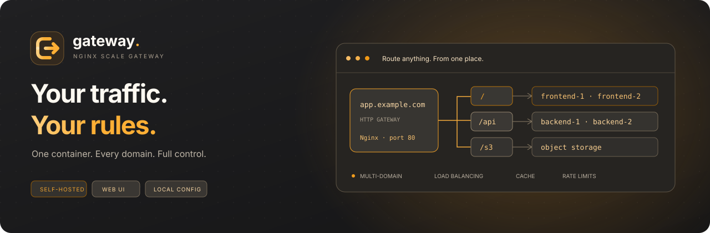
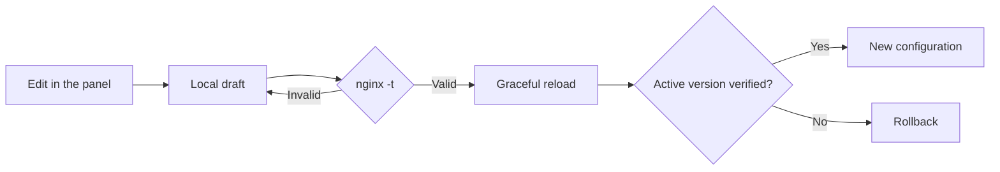

<p align="center"><strong>English</strong> · <a href="README.ru.md">Русский</a></p>

<p align="center"></p>

<p align="center">
  <a href="https://github.com/gadmin2151/ambergate/actions/workflows/docker.yml"></a>
  <a href="https://github.com/gadmin2151/ambergate/pkgs/container/ambergate"></a>
  
  
</p>

<h3 align="center">Your domains. Your applications. One gateway.</h3>
<p align="center">Configure Nginx from a web interface. Route traffic, balance backends, control caching and follow live traffic — with everything stored on your own server.</p>
<p align="center"><a href="#quick-start">Quick start</a> · <a href="#what-you-can-configure">Features</a> · <a href="#docker-container-discovery">Docker discovery</a> · <a href="README.ru.md">Russian guide</a> · <a href="CONTRIBUTING.md">Contributing</a></p>

---

**AmberGate** is a small, self-hosted HTTP gateway built with Nginx, Python's standard library and vanilla JavaScript. One Docker container serves application traffic on **port 80** and the control panel on **port 8083**. Configuration lives on disk. No external database or metrics service is required.

TLS stays with your existing reverse proxy. The panel generates and validates `nginx.conf` from structured settings, then reloads Nginx without stopping applications.

## What you can configure

| Capability | Included |
|:--|:--|
| **Multiple domains** | Independent routes and upstreams per domain; enable/disable domains; search and filters |
| **Path routing** | `/`, `/api`, `/s3`, nested paths; preserve or strip the path prefix; correct path boundaries |
| **Load balancing** | Round robin, least connections, IP hash; server weights and backup targets |
| **Docker discovery** | Select containers and HTTP ports using `docker.sock`; shared-network DNS or published ports through the host IP |
| **Response caching** | Per-route TTL, shared disk budget, public GET/HEAD responses; private requests bypass cache |
| **Traffic limits** | Global per-source-IP request rate and burst, concurrent requests, additional per-route rate limits |
| **HTTP protection** | Body size limits, timeouts, hidden-file protection, security headers and restricted methods |
| **External TLS proxy** | Trusted proxy IP/CIDR, real client addresses and forwarded scheme |
| **WebSocket** | Upgrade handling per route |
| **Live dashboard** | SSE updates, traffic charts, response codes, errors, cache hits, connections and domain statistics |
| **Safe changes** | Drafts, `nginx -t`, graceful reload, active-version verification and rollback on failed apply |
| **Local history** | Last 20 applied versions, restore to draft, JSON import/export |
| **RU / EN interface** | Instant language switch, remembered locally; localized help, dialogs, errors, dates and numbers |
| **Deployment** | First-start installer; one container; GHCR images for amd64 and arm64; built-in health check |

## Quick start

### Install on a Linux server

Supported by the installer: **Debian 12/13**, **Ubuntu 22.04/24.04/26.04**, **amd64 / arm64**.

```bash
git clone https://github.com/gadmin2151/ambergate.git
cd ambergate
sudo bash first-start.sh --with-docker
```

`first-start.sh` checks Docker Engine, the Compose plugin, curl, CA certificates and Python 3. It installs missing components, starts Docker if necessary, prepares **`/opt/ambergate`** and waits for a healthy gateway. Docker packages come from its [official Debian](https://docs.docker.com/engine/install/debian/) or [Ubuntu](https://docs.docker.com/engine/install/ubuntu/) apt repository. Existing packages are not removed; conflicts stop the installer with an explanation.

Read the initial administrator password privately in the container logs:

```bash
sudo docker compose -f /opt/ambergate/compose.yaml logs ambergate
```

Look for `AmberGate admin — initial password`. It appears once when the account is created. Change it in the panel after signing in.

The panel binds to **127.0.0.1:8083** by default. For a remote server, open an SSH tunnel:

```bash
ssh -L 8083:127.0.0.1:8083 user@server
```

Then open **[http://127.0.0.1:8083](http://127.0.0.1:8083)**. To bind a **new installation** to a trusted LAN address, use `--admin-bind 10.0.0.10`.

<details>
<summary><strong>Installer options and repeat runs</strong></summary>

```bash
bash first-start.sh --check
sudo bash first-start.sh --dir /opt/ambergate --http-port 8080 --with-docker
sudo bash first-start.sh --admin-bind 10.0.0.10 --admin-port 8083 --no-start
```

| Option | Purpose |
|:--|:--|
| `--check` | Read-only dependency check; exit 1 if a component is missing or inaccessible |
| `--dir PATH` | Installation directory; default `/opt/ambergate` |
| `--admin-bind IP` | Admin bind address for a new Compose file; default `127.0.0.1` |
| `--admin-port PORT` | Admin port; default `8083` |
| `--http-port PORT` | Application HTTP port; default `80` |
| `--with-docker` | Mount the socket for optional discovery; enable it in the panel |
| `--socket PATH` | Local Docker socket; default `/var/run/docker.sock` |
| `--no-start` | Install dependencies and prepare files without starting gateway |

Repeat runs keep the existing Compose file, password, routes and data. Port and socket-mount options only affect a newly created Compose file. The script pulls an image when needed for startup; use the explicit upgrade commands below to update an existing image. It never changes your external TLS proxy.

The script can also be downloaded by itself and inspected before running; it does not need the cloned repository at runtime. Root/sudo is required for installation. Other operating systems can use the Compose files directly with Docker installed.

</details>

### Already have Docker?

```bash
git clone https://github.com/gadmin2151/ambergate.git
cd ambergate
docker compose -f compose.ghcr.yaml up -d
docker compose -f compose.ghcr.yaml logs ambergate
```

To build locally, run `docker compose up -d --build` instead. Optionally copy `.env.example` to `.env` and set `AMBERGATE_ADMIN_PASSWORD` before the first boot; later password changes are made in the panel.

If port 80 is occupied by your TLS proxy, change the mapping to `127.0.0.1:8080:80` and point that proxy to port 8080.

## Multiple domains, one gateway

| Domain | Route | Upstreams |
|:--|:--|:--|
| `example.com` | `/` | `frontend-1:3000`, `frontend-2:3000` |
| `example.com` | `/api` | `backend-1:8000`, `backend-2:8000` |
| `example.com` | `/s3` | An HTTP storage application supporting that path |
| `app2.example.com` | `/` | `other-frontend:3000` |
| `app2.example.com` | `/api` | `other-backend:8000` |
| `s3.example.com` | `/` | `minio:9000` for a standard S3 API |

1. Choose **Add domain**, enter its DNS name and the first upstream server.
2. Add routes. Set balancing in **Servers**, and response caching and limits in **Cache & limits**.
3. Choose whether to preserve the incoming path or strip the route prefix. For example, `/back/api/` becomes `/api/` when the `/back` prefix is stripped.
4. Click **Apply** to validate and activate the configuration.

Each domain is independent. The panel can load an `example.com` starter configuration; replace example upstreams with reachable applications before applying. Deletion uses an in-panel confirmation dialog. A domain with no routes returns HTTP 404 after applying.

**S3 note:** SigV4 signatures depend on the original Host and path. Use a separate domain with route `/` for a standard S3 API; stripping `/s3` can invalidate signatures. Applications that use absolute URLs may also need their external base path configured.

## Docker container discovery

For an installer deployment, use `--with-docker` on the first run. For repository Compose deployments:

```bash
docker compose -f compose.ghcr.yaml -f compose.docker.yaml up -d
```

Use `compose.yaml` instead of `compose.ghcr.yaml` for a source build. `DOCKER_SOCKET_PATH` in `.env` selects a different host socket.

Open **Docker → Connect Docker**, then **Domains & routes → your route → Servers → Select from Docker**.

| Connection mode | How targets are selected |
|:--|:--|
| **Automatic** | Prefer a shared Docker network; fall back to a published host port |
| **Via host IP** | Use published TCP ports, even when the container belongs to another network |

For a container published as `8001:80`, save the **Docker host IP** in the picker, select **Via host IP**, and the route uses **`host-IP:8001`**. No shared network is required. Ports bound only to host `127.0.0.1` or `::1` cannot be reached from a separate gateway container.

For shared networks, attach applications to `ambergate` and use Docker DNS names. Nginx re-resolves names so a container recreated with the same name can receive a new IP. Selecting multiple containers configures load balancing. Adding new replicas to routes is manual; discovery does not change application networks or continuously rewrite your routes.

The picker shows state, image, networks and TCP ports. Stopped containers and the gateway itself cannot be selected. Ports can be entered manually when `EXPOSE` is absent. Select an **HTTP** application port; discovery does not detect the application protocol.

The Docker socket grants privileged host access. AmberGate only makes read requests, but a `:ro` bind does not make the Docker API itself read-only. Keep the panel on a trusted network. [Detailed network and permission guide in Russian →](docs/configuration.ru.md#docker-socket-и-выбор-контейнеров)

## Know what is happening

The **System overview** receives a dashboard snapshot every second over **one Server-Sent Events connection**. There is no periodic browser HTTP polling.

- **Traffic:** completed requests, current rate, 15-minute chart and bytes sent.
- **Responses:** 5xx errors, average response duration, approximate p95 and HTTP code distribution.
- **Cache and limits:** cache hit ratio and requests rejected by gateway limits.
- **Nginx:** health, uptime, open connections and active configuration version.
- **Domains:** request volume, errors and response times per domain.
- **Recent errors:** up to 30 latest 4xx/5xx responses with domain, route and duration.

The dashboard distinguishes the active configuration from your draft. Connection loss shows a stale snapshot and triggers reconnection. Hidden tabs close the stream and reconnect when visible; signing out closes it too. Live updates do not interrupt route editing.

Metrics use bounded local memory, with 10-second buckets for up to 15 minutes. Restarting clears this history. Panel requests and health checks are excluded. No traffic means no invented statistics; p95 is approximate and response duration includes transfer to the client.

## Draft, validate, apply



**Save draft** persists your edits without changing traffic. **Apply** saves, validates and activates them. Draft and active configuration survive restarts independently. Restore any retained version into the draft and apply it when ready.

Switch **RU / EN** on the login screen or top bar. The preference is stored in your browser; switching preserves unsaved fields. User-defined domain names, route names, addresses and Nginx configuration are not translated.

Keyboard shortcuts: **`/`** focuses route search, **`Ctrl/Cmd + S`** saves a draft. Route-editor tabs and confirmation dialogs support keyboard navigation.

## Storage, backup and upgrades

| Content | Container path | Installer directory |
|:--|:--|:--|
| Draft, active config, credentials, Docker settings, history | `/data` | `/opt/ambergate/data` |
| Response cache | `/cache` | `/opt/ambergate/cache` |
| Runtime files | `/run/ambergate` | `/opt/ambergate/run` |

Repository Compose files use named volumes `ambergate-data` and `ambergate-cache`. The installer uses bind directories under its installation path. Keep `/data` and your Compose file in backups. Treat backups as private because they include authentication data and internal addresses. For a consistent filesystem backup, briefly stop gateway or use a filesystem snapshot; JSON export transfers routing settings but not the administrator account or Docker connection settings.

For an installer deployment:

```bash
cd /opt/ambergate
sudo docker compose pull
sudo docker compose up -d --wait
```

For a repository deployment, include `-f compose.ghcr.yaml` and the Docker overlay if used. Never use `down -v` unless you intend to delete named volumes. Image upgrades are explicit; there is no background auto-updater.

## Upgrading from Nginx Scale Gateway

The project is now **AmberGate**. For an existing deployment, back up `/data` and your Compose file, then change only the image to `ghcr.io/gadmin2151/ambergate:latest` in **your existing Compose file** and run `docker compose pull && docker compose up -d --wait` in its current directory. Keep the existing project name, service, networks and data/cache mounts: replacing them with the new example names can create empty volumes. Do not use `down -v`.

Existing routing data, history, administrator credentials and Docker settings are compatible. `AMBERGATE_*` environment variables replace `GATEWAY_*`; the old prefix still works when the corresponding new variable is absent. Existing `GATEWAY_RUN_DIR` overrides remain supported; the new default is `/run/ambergate`. The cache response header is now `X-AmberGate-Cache`, with `X-Gateway-Cache` retained for compatibility. Browser language preferences migrate automatically; sign in again after upgrading.

New installations use `/opt/ambergate`. The installer detects an old default installation and asks you to upgrade it in place; use `--dir /opt/nginx-scale-gw` to retain its directory. If you also rename a container, update its saved **Docker → AmberGate container** setting. Renaming the installation directory is optional.

## Build and delivery

[GitHub Actions](.github/workflows/docker.yml) validates JavaScript, translations, the installer and Compose, runs routing tests with real Nginx, and exercises Docker discovery and load balancing against real containers. Successful releases publish **`linux/amd64`** and **`linux/arm64`** images to [GitHub Container Registry](https://github.com/gadmin2151/ambergate/pkgs/container/ambergate) with OCI metadata, provenance and SBOM.

| Trigger | Result |
|:--|:--|
| Push to `main` | Tests, `latest` and `sha-<full-commit-SHA>` |
| Tag `v1.2.3` | Tests, `1.2.3`, `1.2` and SHA tag |
| Pull request | Tests without publication |
| Manual workflow | Tests; publication only from `main` or a `v*` tag |

The workflow uses `GITHUB_TOKEN` with `packages: write`; no Docker Hub credentials are needed. Actions are pinned to commit SHAs. [Development and contribution guide →](CONTRIBUTING.md)

## Scope and defaults

- **HTTP gateway:** external TLS termination; no certificate management, upstream HTTPS, gRPC, raw TCP proxy or full WAF.
- **Trusted proxies:** configure only your actual proxy IP/CIDR so per-client limits use the correct address.
- **Caching:** enable it for public responses. Authorization, cookies, Set-Cookie, common signed parameters and WebSocket bypass caching; upstream Cache-Control and Vary are respected.
- **Structured configuration:** preview and copy generated `nginx.conf`; arbitrary directive editing is not available.
- **Local administration:** password login, CSRF protection and expiring sessions. Expose the panel only through a trusted network or your secured external proxy.

<p align="center"><br><br><sub>Small by design. Yours by default.</sub></p>
