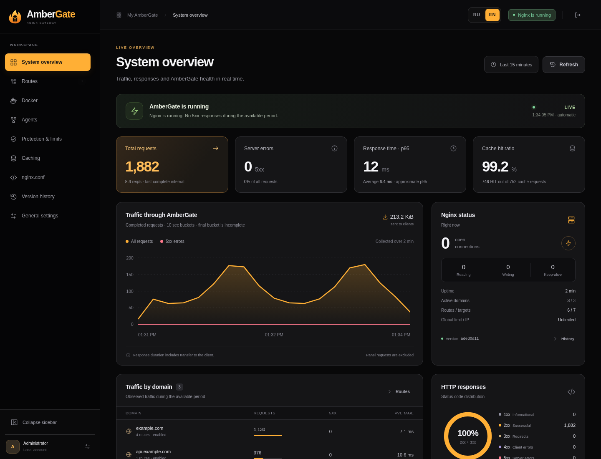
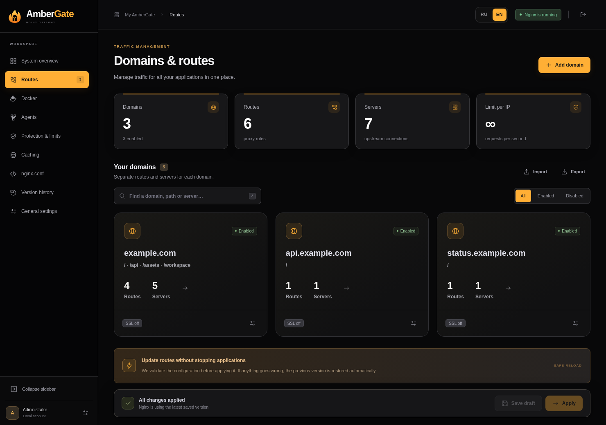
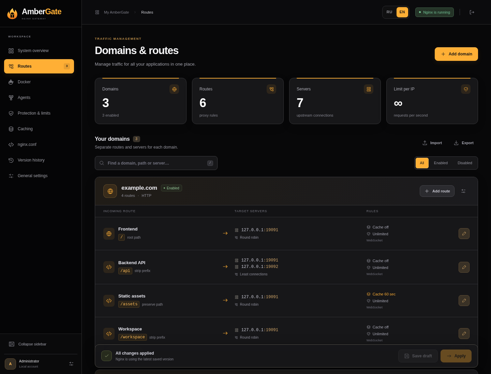
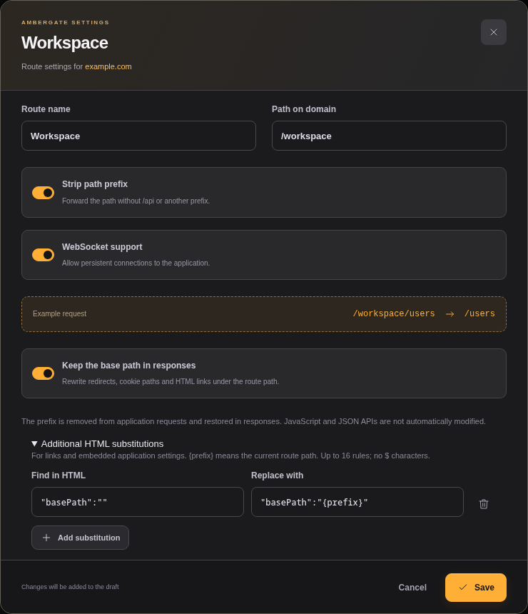
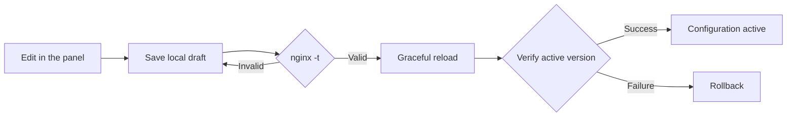

<p align="center"><strong>English</strong> · <a href="README.ru.md">Русский</a></p>

<p align="center"></p>

<p align="center">
  <a href="https://github.com/gadmin2151/ambergate/actions/workflows/docker.yml"></a>
  <a href="https://github.com/gadmin2151/ambergate/pkgs/container/ambergate"></a>
  
  <a href="LICENSE"></a>
</p>

<h3 align="center">Your domains. Your applications. One gateway.</h3>
<p align="center">Manage Nginx from a web interface. Connect Docker machines, route and balance traffic, and see what is happening — with configuration stored on your own server.</p>
<p align="center"><a href="#quick-start">Quick start</a> · <a href="#what-you-can-configure">Features</a> · <a href="#service-map">Service map</a> · <a href="#remote-agents">Agents</a> · <a href="#response-rewriting">Response rewriting</a> · <a href="#documentation">Documentation</a></p>

**AmberGate** is a self-hosted HTTP gateway built with Nginx, a Python control plane and vanilla JavaScript. The central gateway and panel run in **one Docker container**. Add one optional agent container per remote Docker machine. No external database or metrics service is required; keep your existing TLS proxy or enable per-domain Let’s Encrypt SSL.

| Application traffic | Control panel | Configuration | Images |
|:--|:--|:--|:--|
| HTTP · **80** | **8083** · RU / EN | Local files in **`/data`** | **amd64 / arm64** |

[](docs/screenshots/dashboard.en.png)
<p align="center"><sub>Actual AmberGate UI on an isolated demo instance. Example domains and locally generated test traffic; no production data.</sub></p>

> **v0.2.0:** bounded admin requests, per-agent tunnel quotas and trusted-proxy login limits. [Upgrade notes](CHANGELOG.md#020--2026-09-23) · [Control-panel setup](docs/control-plane-security.md)

## What you can configure

| Capability | What it does |
|:--|:--|
| **Domains & routes** | Independent hosts and paths, nested prefixes, route search and domain enable/disable |
| **Load balancing** | Round robin, least connections, IP hash, weights and backup servers |
| **Response rewriting** | Keep an app under `/workspace`: rewrite redirects, cookie paths and HTML links; add custom HTML substitutions |
| **Local Docker** | Discover containers through `docker.sock`; select shared-network targets or published ports via the host IP |
| **[Remote agents](#remote-agents)** | Outbound HTTPS/WSS tunnels, manual container selection and balancing across machines; no agent or app ports to publish |
| **Extended agent access** | Optional Linux namespace mode for private ports, localhost listeners and `network=none` containers |
| **One-line labels** | Automatic routes and replica balancing, existing route groups, preview or automatic apply |
| **Cache & limits** | Public GET/HEAD caching per route, a shared disk budget, per-source-IP rates, bursts and concurrent request limits |
| **HTTP protection** | Request-body limits, timeouts, restricted methods, hidden-file protection and security headers |
| **Live dashboard** | SSE traffic charts, response codes, p95, cache hits, connections, domain statistics and recent errors |
| **Safe configuration** | Drafts, `nginx -t`, graceful reload, active-version verification and rollback if apply fails |
| **Local history** | Last 20 applied versions, restore to draft, JSON import/export and generated `nginx.conf` preview |
| **Usable every day** | RU / EN, keyboard shortcuts, confirmation dialogs, fixed scrolling sidebar and remembered compact mode |

Caching bypasses requests with authorization, cookies or common signed parameters, responses with `Set-Cookie`, and WebSocket traffic. Upstream `Cache-Control` and `Vary` are respected.

## Quick start

### Install on a Linux server

For **Debian 12/13** or **Ubuntu 22.04/24.04/26.04**, on amd64 or arm64:

```bash
git clone https://github.com/gadmin2151/ambergate.git
cd ambergate
sudo bash first-start.sh --with-docker
```

The installer checks Docker Engine, the Compose plugin, curl, CA certificates and Python 3; installs missing dependencies; prepares **`/opt/ambergate`** and waits for a healthy gateway. `--with-docker` mounts the optional discovery socket. Docker packages come from Docker's official apt repository; conflicting packages stop the installer with an explanation.

Read the initial password from the container logs. It appears once as `AmberGate admin — initial password`; change it in the panel after signing in.

```bash
sudo docker compose -f /opt/ambergate/compose.yaml logs ambergate
```

The panel binds to **127.0.0.1:8083** by default. From your computer, open a tunnel to the server:

```bash
ssh -L 8083:127.0.0.1:8083 user@server
```

Open **[http://127.0.0.1:8083](http://127.0.0.1:8083)**.

<details>
<summary><strong>Installer options</strong></summary>

| Option | Purpose |
|:--|:--|
| `--check` | Read-only dependency check; exit 1 if a dependency is missing or inaccessible |
| `--dir PATH` | Installation directory; default `/opt/ambergate` |
| `--admin-bind IP` | Admin bind address for a new Compose file; default `127.0.0.1` |
| `--admin-port PORT` / `--http-port PORT` | Panel and application ports; defaults `8083` / `80` |
| `--with-docker` / `--socket PATH` | Mount the discovery socket; default `/var/run/docker.sock` |
| `--no-start` | Prepare dependencies and files without starting the gateway |

For a **new** LAN installation, use `--admin-bind 10.0.0.10`. Repeat runs keep the existing Compose file, password, routes and data; port and mount options only affect a newly created Compose file. Root/sudo is required. The script can also run on its own without a cloned repository. It does not modify your external TLS proxy.

</details>

### Already have Docker?

```bash
git clone https://github.com/gadmin2151/ambergate.git
cd ambergate
docker compose -f compose.ghcr.yaml up -d
docker compose -f compose.ghcr.yaml logs ambergate
```

To build from source, use `docker compose up -d --build`. You can copy [`.env.example`](.env.example) to `.env` and set `AMBERGATE_ADMIN_PASSWORD` before the first boot. Later password changes happen in the panel.

If your TLS proxy already occupies port 80, map the gateway to `127.0.0.1:8080:80` and forward application traffic there. The panel and agent API use the separate listener on **8083**.

## Domain workspaces & optional SSL

Open **Routes** to see all domains as tiles. Select a domain to manage its routes, target servers and SSL settings in one workspace.



**Let’s Encrypt is off by default.** Enable it in domain settings, enter an email and apply. Certificates renew automatically **5 days before expiry**; change the window per domain. Issuance errors and expiry dates update live through SSE. HTTP → HTTPS redirection is optional.

For HTTPS, publish port 443 with `compose.tls.yaml` or `first-start.sh --with-tls`. Public port 80 must reach the gateway for HTTP-01 checks. [Setup, renewal and external proxy details →](docs/ssl.md)

## Multiple domains, one gateway

| Domain | Path | Destination |
|:--|:--|:--|
| `example.com` | `/` | Frontend replicas |
| `example.com` | `/api` | Backend replicas, locally or through agents |
| `example.com` | `/workspace` | An application mounted under a path |
| `status.example.com` | `/` | Status page |
| `s3.example.com` | `/` | Standard MinIO / S3 API |

**Add domain → add routes → select servers → Apply.** Keep or strip each route's prefix: stripping `/back` turns `/back/api/` into `/api/` at the upstream. Select multiple targets to balance traffic. Domains with no routes return 404 after applying.

<details>
<summary><strong>See the domains and routes screen</strong></summary>



</details>

## Response rewriting

An app may return `Location: /login` even when its public route is `/workspace`. Enable **Keep the base path in responses** in the route editor:

| Direction | Example |
|:--|:--|
| Browser → application | `/workspace/login` becomes `/login` |
| Redirect → browser | `/login` becomes `/workspace/login` |
| HTML → browser | `href="/assets/app.css"` becomes `href="/workspace/assets/app.css"` |
| Cookie → browser | `Path=/` becomes `Path=/workspace/` |

The upstream configuration stays unchanged. This works with direct targets and agent tunnels, including HTTPS clients using managed SSL or an external TLS proxy. **Additional HTML substitutions** support application-specific strings through a generic editor; `{prefix}` expands to the route path.

<details>
<summary><strong>See the response rewriting editor</strong></summary>



</details>

HTML rewriting is opt-in. It does not automatically rewrite JS bundles, JSON APIs, CSS or every URL assembled by an application. Some applications need extra route rules or a dedicated domain. Standard S3 signatures depend on Host and path: use a separate domain with `/` instead of rewriting a signed S3 API. **[Behavior, examples and limits →](docs/response-rewriting.md)**

## Docker container discovery

Mount the local Docker socket, then enable discovery in **Docker → Connect Docker**:

```bash
docker compose -f compose.ghcr.yaml -f compose.docker.yaml up -d
```

Open a route's **Servers → Choose from Docker**. Local discovery prefers a shared Docker network. Alternatively, save the **Docker host IP** and use a published port: `8001:80` becomes `host-IP:8001`. A host port bound only to localhost is unavailable to a gateway in another network.

Container names on shared Docker networks are re-resolved after recreation. Choose several containers for balancing, or enter the HTTP port manually when `EXPOSE` is absent. Manual selection tracks the chosen targets; labels track new replicas automatically. Discovery does not move containers between networks or perform application readiness checks.

Docker socket access grants host privileges at the API level; a `:ro` mount does not make the API read-only. AmberGate only reads Docker metadata. **[Network and permission details (RU) →](docs/configuration.ru.md#docker-socket-и-выбор-контейнеров)**

## Service map

See how the external TLS proxy, central AmberGate, local applications and remote Docker machines connect. Dashed links show connections initiated by agents; application traffic uses their established tunnels.

[](docs/diagrams/service-map.en.png)

<details>
<summary><strong>Follow a request and its response</strong></summary>

[](docs/diagrams/request-flow.en.png)

</details>

These are diagrams of an example deployment, not a live map of a particular server. **[Connections, ports and vector versions →](docs/architecture.md)**

<a id="remote-docker-machines"></a>

## Remote agents

One **AmberGate Agent** container on each machine discovers local containers and carries their traffic over an outbound tunnel. Applications and agents need **no published ports**. Central Nginx still controls routing, balancing, caching and limits.

### How it works

1. The agent reads the local **`docker.sock`** to discover containers, their state, private ports, networks and routing labels. It reports a fresh inventory to the center every **5 seconds** by default. Environment variables, mounts and unrelated labels are excluded from reports.
2. The agent **initiates the connection to the center** over HTTPS/WSS using its own token. The remote machine needs no inbound agent port, only access to the central address and selected applications. Central AmberGate needs no direct access to that machine's Docker socket or IP address.
3. Select containers for a route in the panel, or enable automation through **`ambergate.route`** labels. The center generates and validates the Nginx configuration; the agent provides the connection to the application.
4. When a request arrives, Nginx selects a target container and the agent delivers the request through the tunnel. The response returns along the same path. Streaming uploads, SSE and application WebSockets are supported.

```text
Client → central Nginx → WSS tunnel → agent → container HTTP port
Client ← central Nginx ← WSS tunnel ← agent ← application response
```

The agent opens the tunnel, even though application requests travel from the center to the application. An external TLS proxy in front of panel port **8083** terminates HTTPS for agents; application-domain SSL is configured separately.

### Why use agents?

| Benefit | In practice |
|:--|:--|
| **Works behind NAT** | Connect machines in an office, home network or another data center. This tunnel needs no port forwarding or separate VPN as long as the agent can reach the center |
| **Private application ports** | A backend can listen only inside Docker, without publishing ports such as `3000` or `8080` on its host |
| **One panel for every machine** | Remote containers appear in the same route editor as local ones; manage domains, caching and limits centrally |
| **Balancing across servers** | Combine containers from different agents and local targets in one route, with weights, balancing algorithms and backup servers |
| **Less manual maintenance** | Labels can add new replicas to the balancer. When a manually selected container is recreated with the same name, its address updates after the next report |
| **Access across Docker networks** | Choose host networking or extended namespace access to match application isolation; modes and required permissions are explained below |

**Example:** two machines behind NAT, each running an agent and a backend on private port `3000`. Give both backends the same label, `ambergate.route: "host=example.com; path=/api; port=3000; strip=true"`, and enable **Apply automatically**. AmberGate creates one `/api` route with two targets on different machines, without publishing port `3000`.

If the connection drops, the agent reconnects automatically and the panel shows its state. Existing connections end when the tunnel disconnects. For routes with multiple targets, Nginx may try another target according to its retry settings; the tunnel does not replace application readiness checks.

### Connect in a few steps

1. Save the central address in **General settings**, for example `ambergate.exemple.com`.
2. Open **Agents → Add agent** and choose the connection mode.
3. Copy the ready-to-run **single-line `docker run` command**, or download **Docker Compose**.
4. Run it on the remote Docker machine. The wizard shows the connection through SSE.
5. In the route's Docker picker, choose the agent as **Container source**, select containers and apply. Or use labels for automatic discovery.

| Agent mode | When to use it |
|:--|:--|
| **Host network** · default | Native Linux Docker Engine; private IPs across local bridge networks without creating a new network |
| **Specific Docker network** | Limit reachability to existing shared networks, or use environments where host mode is unsuitable |
| **Extended access · namespace** | Native rootful Linux; enter the selected container's network namespace to reach even localhost listeners or `network=none` |

Extended mode adds **host PID access**, `SYS_ADMIN`, `SYS_PTRACE` and `AMBERGATE_AGENT_NAMESPACE=true`. It is an explicit privileged option for trusted hosts; host security policies may restrict it. It does not change application networks or require full `--privileged` mode. Update central AmberGate first, then **recreate** the agent using the generated command; a restart alone cannot add capabilities.

Domains use **HTTPS/WSS** through your external TLS proxy to central port **8083**. A plain IP such as `10.0.0.10` becomes `http://10.0.0.10:8083` only after an explicit warning and confirmation; tokens and traffic are then unencrypted. Keep installation tokens private.

**[Agent guide →](docs/agents.md)** · **[Standard Compose](compose.agent.yaml)** · **[Namespace Compose](compose.agent.namespace.yaml)** · **[Application + agent example](examples/agent.compose.yaml)**

## Automatic routes from Docker labels

**One line** describes a route. Containers with matching host, path and route options join the same load balancer, including replicas on different agents:

```yaml
labels: { ambergate.route: "host=example.com; path=/api; port=3000; strip=true; balance=least_conn" }
```

To join an existing route, set its **Docker group** to `app-api` and use:

```yaml
labels: { ambergate.route: "group=app-api; port=3000; weight=2" }
```

Choose **Off**, **Preview changes** or **Apply automatically**. Reconciliation runs every 5 seconds; changed configurations pass validation and a verified reload. Unrelated draft edits remain unapplied. Empty managed routes return 503 rather than falling through to another app.

<a id="label-reference"></a>
**[Full label reference →](docs/docker-labels.md)** · **[Runnable Compose examples →](examples/docker-labels.compose.yaml)**

## Live visibility and safe changes

The dashboard uses **one SSE connection**, with snapshots every second. It shows completed requests, rate, 5xx errors, approximate p95, cache hits, open connections, domain activity and recent 4xx/5xx responses. Metrics stay in bounded local memory for up to 15 minutes and reset on restart. Panel traffic and health checks are excluded; no traffic means no invented statistics.



**Save draft** persists changes without affecting traffic; **Apply** validates and activates them. Restore any of the last 20 versions into the draft. The RU / EN switch preserves unsaved fields. Use **`/`** to focus route search and **`Ctrl/Cmd + S`** to save. The sidebar scrolls independently and remembers its collapsed state; clicking the logo opens the dashboard.

## Storage, backup and upgrades

| Content | Container path | Installer path |
|:--|:--|:--|
| Settings, routes, credentials, agents, tunnel mappings and history | `/data` | `/opt/ambergate/data` |
| Response cache | `/cache` | `/opt/ambergate/cache` |
| Runtime files | `/run/ambergate` | `/opt/ambergate/run` |

Repository Compose files use named data/cache volumes; the installer uses directories under `/opt/ambergate`. Back up the **complete `/data` directory and Compose file** privately. Use a filesystem snapshot or briefly stop the gateway for a consistent backup. Routing JSON alone does not transfer accounts, agent identities or tunnel mappings.

For an installer deployment:

```bash
cd /opt/ambergate
sudo docker compose pull
sudo docker compose up -d --wait
```

For repository deployments, include `-f compose.ghcr.yaml` and any overlays you use. Update the center before agents and prefer matching image versions. **Do not use `down -v`** when keeping data. There is no background image updater.

<details>
<summary><strong>Upgrading from Nginx Scale Gateway</strong></summary>

Keep your existing Compose project, service, networks and volumes; change only the image to `ghcr.io/gadmin2151/ambergate:latest`, then pull and recreate. Replacing volume names can create an empty installation. Existing routes, history, credentials and Docker settings remain compatible. The old `GATEWAY_*` variables work when their `AMBERGATE_*` counterparts are absent; the legacy cache header and browser language preference are supported too.

The installer detects the old default directory; use `--dir /opt/nginx-scale-gw` to retain it. Renaming the directory is optional. If the container is renamed, update **Docker → AmberGate container**. Sign in again after upgrading.

</details>

## Build and delivery

[GitHub Actions](.github/workflows/docker.yml) validates the installer, Compose and JavaScript; tests routing, caching, authentication and response rewriting with real Nginx; then exercises real Docker discovery and agents over verified TLS. Agent tests cover multiple networks, namespace access, loopback-only apps, uploads, recreation, restart, lease expiry and token revocation.

Both images are published for **`linux/amd64` and `linux/arm64`**, with OCI metadata, provenance and SBOM:

| Image | Purpose |
|:--|:--|
| [`ghcr.io/gadmin2151/ambergate`](https://github.com/gadmin2151/ambergate/pkgs/container/ambergate) | Central gateway and web panel |
| [`ghcr.io/gadmin2151/ambergate-agent`](https://github.com/gadmin2151/ambergate/pkgs/container/ambergate-agent) | Remote Docker discovery and traffic tunnel |

Pushes to `main` publish `latest` and `sha-<full-commit-SHA>`. Version tags publish matching full/minor version tags and a SHA tag. Pull requests run checks without publishing. Builds use `GITHUB_TOKEN`; no Docker Hub credentials are needed.

## Documentation

| Guide | Contents |
|:--|:--|
| [Service map and request journey](docs/architecture.md) | Connection diagrams, component roles, ports and tunnels |
| [Optional SSL](docs/ssl.md) | Let’s Encrypt, automatic renewal, ports and certificate storage |
| [Agent setup](docs/agents.md) | One-command installation, network modes, TLS proxy, tokens and limits |
| [Docker labels](docs/docker-labels.md) | All keys, groups, conflicts, failure behavior and examples |
| [Response rewriting](docs/response-rewriting.md) | Redirects, cookies, HTML rules and compatibility limits |
| [Configuration reference (RU)](docs/configuration.ru.md) | Routing, cache, protection, local development and metrics |
| [Contributing](CONTRIBUTING.md) | Development, tests, project layout and translations |
| [Screenshot notes](docs/screenshots/README.md) | Demo environment and image provenance |

**Scope:** HTTP applications and WebSocket upgrades. Optional Let’s Encrypt SSL uses HTTP-01; wildcard certificates, IP certificates, DNS-01, upstream HTTPS, gRPC, raw TCP forwarding and a full WAF are not provided. `nginx.conf` is generated from validated fields, not edited as arbitrary directives. Configure trusted proxy IPs/CIDRs for correct client-IP limits, and keep administration on a trusted network or secured external proxy.

## Community & contributing

AmberGate is an early project released under the [MIT license](LICENSE). Start with a test deployment, share your use case and help make the setup and behavior clearer.

[Ask a question](https://github.com/gadmin2151/ambergate/discussions) · [Report a bug](https://github.com/gadmin2151/ambergate/issues/new/choose) · [Contribute](CONTRIBUTING.md) · [Changelog](CHANGELOG.md) · [Security](SECURITY.md)

Good first contributions include testing Compose examples, improving RU/EN translations, documentation and reproducible routing tests. If AmberGate is useful to you, a GitHub star helps other people discover it.

<p align="center"><br><br><sub>Your server. Your traffic. Your rules.</sub></p>
