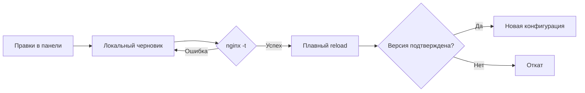

<p align="center">
  
</p>

<p align="center">
  <a href="https://github.com/gadmin2151/nginx-scale-gw/actions/workflows/docker.yml"></a>
  
  
  
</p>

<p align="center">
  <b>Ваш Nginx. Несколько доменов. Одна удобная панель.</b><br>
  Маршруты, балансировка, кеш и защита приложений — в одном Docker-контейнере.
</p>

<p align="center">
  <a href="#быстрый-старт">Быстрый старт</a> ·
  <a href="#несколько-доменов--один-gateway">Домены и маршруты</a> ·
  <a href="docs/configuration.ru.md">Полная документация</a> ·
  <a href="https://github.com/users/gadmin2151/packages/container/package/nginx-scale-gw">Docker image</a>
</p>

---

**Nginx Scale Gateway** превращает настройку Nginx в простой процесс: добавьте домен, укажите приложения, проверьте конфигурацию и примените её из браузера. Nginx передаёт трафик напрямую; небольшой Python-сервис отвечает только за управление.

Без внешней БД, frontend-сборки, CDN и облачных зависимостей во время работы. Все настройки и история хранятся локально. **SSL остаётся на вашем внешнем прокси.**

## Что умеет

| Возможность | Что вы получаете |
|:--|:--|
| **Живой dashboard** | График трафика, RPS, задержки, ошибки, кеш, соединения и статистика доменов |
| **Docker discovery** | Подключение к docker.sock, выбор контейнеров и TCP-портов для маршрутов и балансировки |
| **Несколько доменов** | Независимые маршруты и upstream для каждого домена; поиск и фильтры |
| **Маршрутизация** | `/`, `/api`, `/s3`, вложенные пути, сохранение или удаление префикса |
| **Балансировка** | Round robin, least connections, IP hash, веса и резервные серверы |
| **Кеш** | TTL на маршрут, общий размер дискового кеша, обход приватных запросов |
| **Защита** | Лимиты на IP, burst, соединения, размер запроса, скрытые файлы и security headers |
| **Работа за SSL-прокси** | Доверенные CIDR, реальный IP клиента, корректная внешняя схема |
| **Безопасное применение** | Проверка `nginx -t`, плавный reload, подтверждение версии и откат |
| **История и перенос** | 20 версий, восстановление, импорт и экспорт JSON |
| **Современная панель** | Чёрно-золотая тема, удобные вкладки, мобильная версия, постоянные кнопки сохранения |

## Что происходит с gateway

После входа открывается **«Обзор системы»** — рабочий dashboard в чёрно-янтарной теме, с обновлением каждые 5 секунд.

- **Трафик:** количество запросов, текущая скорость, график за последние 15 минут и объём отданных данных.
- **Ответы:** ошибки 5xx, среднее время ответа, приблизительный p95 и распределение HTTP-кодов.
- **Кеш и защита:** доля HIT и запросы, отклонённые лимитами самого gateway.
- **Nginx:** состояние, время работы, открытые соединения и действующая версия конфигурации.
- **Домены:** запросы, ошибки и задержки отдельно для каждого домена.
- **Проблемные ответы:** последние 30 ответов 4xx/5xx с доменом, маршрутом и длительностью.

Это реальные измерения завершённых HTTP-запросов. Пока трафика нет, dashboard показывает ожидание данных. Запросы админки и служебные проверки не попадают в статистику трафика. Черновик и действующие настройки обозначены отдельно.

Метрики собираются локально в ограниченной памяти, без дополнительных контейнеров, файлов журналов или внешних сервисов. История сбрасывается при перезапуске; подробности расчёта и ограничения описаны в [документации dashboard](docs/configuration.ru.md#dashboard-и-метрики).

## Быстрый старт

### Готовый образ из GitHub Container Registry

```bash
git clone git@github.com:gadmin2151/nginx-scale-gw.git
cd nginx-scale-gw
docker compose -f compose.ghcr.yaml up -d
docker compose -f compose.ghcr.yaml logs gateway
```

Откройте **[http://127.0.0.1:8083](http://127.0.0.1:8083)**. Начальный случайный пароль появится один раз в логах: `Gateway admin — initial password`.

| Назначение | Адрес / хранение |
|:--|:--|
| Трафик приложений | HTTP, порт **80** |
| Панель управления | Порт **8083**, опубликован на loopback хоста |
| Настройки и история | Volume `gateway-data` → `/data` |
| Кеш | Volume `gateway-cache` → `/cache` |
| Образ | `ghcr.io/gadmin2151/nginx-scale-gw:latest` |

При желании скопируйте `.env.example` в `.env` и задайте `GATEWAY_ADMIN_PASSWORD` перед первым запуском. После создания аккаунта пароль меняется в панели.

### Сборка самостоятельно

```bash
docker compose up -d --build
docker compose logs gateway
```

> Если порт 80 уже занят вашим SSL-прокси, замените публикацию на `127.0.0.1:8080:80` и направьте прокси на порт 8080. Для доступа к панели удалённого сервера: `ssh -L 8083:127.0.0.1:8083 user@server`.

## Маршруты прямо на Docker-контейнеры

Подключение Docker необязательно. Чтобы выбирать контейнеры в панели, добавьте socket через готовый Compose overlay:

```bash
docker compose -f compose.ghcr.yaml -f compose.docker.yaml up -d
```

Для сборки из исходников используйте `compose.yaml` вместо `compose.ghcr.yaml`. Если socket находится в другом месте, укажите `DOCKER_SOCKET_PATH` в `.env` — например `/run/user/1000/docker.sock` для rootless Docker.

1. Откройте **Docker → Подключить Docker**. Путь внутри контейнера по умолчанию — `/var/run/docker.sock`.
2. Подключите приложения и gateway к общей пользовательской сети Docker, например `nginx-gateway`.
3. При создании домена или в **Маршрут → Серверы → Выбрать из Docker** отметьте нужные контейнеры и порты.
4. Настройте Round robin / Least connections, веса и резервные цели. Сохраните маршрут и нажмите **«Применить»**.

В пользовательской сети сохраняются Docker-имена, а Nginx обновляет их IP через Docker DNS. Для пересоздания контейнера с тем же именем менять маршрут не требуется. Новые реплики добавляются в маршрут через выбор контейнеров; автоматического изменения числа целей нет. Локальная панель вне контейнера предлагает опубликованные TCP-порты хоста.

Панель показывает сеть, состояние, образ и порты, отмечает остановленные контейнеры и отсутствие общей сети. Если приложение не объявило порт, его можно ввести вручную. **Нужен HTTP-порт приложения; discovery не проверяет протокол.**

Docker socket даёт привилегированный доступ к Docker-хосту. Gateway использует только GET-запросы для обнаружения; монтирование `:ro` не делает сам Docker API доступным только для чтения. [Настройка сетей, ограничения и права доступа →](docs/configuration.ru.md#docker-socket-и-выбор-контейнеров)

## Несколько доменов — один gateway

Каждый домен имеет собственный набор маршрутов. Например:

| Домен | Путь | Приложение |
|:--|:--|:--|
| `example.com` | `/` | `frontend-1:3000`, `frontend-2:3000` |
| `example.com` | `/api` | `backend-1:8000`, `backend-2:8000` |
| `example.com` | `/s3` | HTTP-хранилище, принимающее этот путь |
| `app2.example.com` | `/` | `other-frontend:3000` |
| `app2.example.com` | `/api` | `other-backend:8000` |
| `s3.example.com` | `/` | `minio:9000` — стандартный S3 API |

1. Нажмите **«Добавить домен»** и укажите имя и первый upstream.
2. Добавьте маршруты. Во вкладке **«Серверы»** настройте балансировку; в **«Кеш и лимиты»** — правила маршрута.
3. Добавьте следующий домен тем же способом. Настройки доменов независимы.
4. Нажмите **«Применить»**. Сервис проверит и загрузит конфигурацию.

Удаление маршрутов и доменов подтверждается в панели. После удаления нажмите **«Сохранить черновик»** или **«Применить»**. Последний маршрут тоже можно удалить: домен останется и после применения будет отвечать HTTP 404 до добавления нового маршрута.

В пустой панели есть готовый пример для `example.com`. Замените адреса примера своими. Приложения должны быть доступны из сети контейнера: Compose создаёт сеть `nginx-gateway`; подключите к ней контейнеры приложений или используйте доступные IP.

**S3:** SigV4 зависит от исходного пути и Host. Стандартный MinIO/S3 API лучше вынести на отдельный домен с маршрутом `/`; удаление `/s3` может нарушить подпись. [Подробности →](docs/configuration.ru.md#s3-и-префикс-s3)

## Как применяются изменения



**Сохранить черновик** записывает настройки, не меняя текущий трафик. **Применить** сохраняет, проверяет и активирует их. Черновик и действующая конфигурация переживают перезапуск независимо друг от друга.

В панели можно нажать **`/`**, чтобы перейти к поиску, и **`Ctrl/Cmd + S`**, чтобы сохранить черновик. Вкладки редактора поддерживают клавиатуру.

## Сборка и публикация образа

[GitHub Actions](.github/workflows/docker.yml) автоматически:

1. Проверяет JavaScript и Compose, собирает Docker-образ.
2. Запускает тесты с настоящим Nginx **внутри образа** и проверяет запуск контейнера.
3. Проверяет discovery через настоящий Docker socket, балансировку двух контейнеров и обновление DNS после пересоздания контейнера с другим IP.
4. После успешных проверок публикует образ в **GHCR** для `linux/amd64` и `linux/arm64`, с OCI-метаданными, provenance и SBOM.

| Событие | Результат |
|:--|:--|
| Push в `main` | Проверки, публикация `latest` и `sha-<полный commit SHA>` |
| Тег `v1.2.3` | Проверки, публикация `1.2.3`, `1.2` и SHA-тега |
| Pull request | Проверки без публикации |
| Ручной запуск workflow | Проверки; публикация только из `main` или тега `v*` |

Используется встроенный `GITHUB_TOKEN` с `packages: write`; отдельные Docker Hub credentials не нужны. Actions закреплены полными commit SHA. Новые GHCR packages могут изначально иметь видимость private — для анонимного `docker pull` установите public в настройках package.

Обновление установленного сервиса:

```bash
docker compose -f compose.ghcr.yaml pull
docker compose -f compose.ghcr.yaml up -d
```

## Разработка и проверки

```bash
python3 -m unittest tests.test_config -v
node --check gateway/static/app.js
node --check gateway/static/dashboard.js
node --check gateway/static/docker.js
docker compose config --quiet
```

Полный набор проверяет маршруты и их границы, несколько доменов, алгоритмы балансировки, резервные серверы, WebSocket upgrade, кеш и приватные ответы, IP-лимиты, auth/CSRF, историю и откат. Проверки dashboard включают реальный трафик, метрики кеша и ошибок, ограничение памяти, исключение служебных запросов и обновление старой конфигурации с сохранением черновика.

```bash
docker compose build
docker run --rm --entrypoint python3 \
  -v "$PWD/tests:/app/tests:ro" \
  local/nginx-gateway:latest -m unittest discover -v
```

Интеграционные тесты требуют Nginx 1.28+; без него они помечаются как skipped. [Локальный запуск без Docker и полное описание настроек →](docs/configuration.ru.md#разработка-и-проверки)

## Важно при настройке

- За внешним SSL-прокси укажите его **доверенный IP/CIDR**: иначе пользователи разделят лимит IP прокси.
- Кешируйте только публичные ответы. Authorization, cookies, Set-Cookie и типовые подписанные параметры исключены из кеша.
- Это **HTTP gateway**, а не WAF, TCP-прокси или TLS-менеджер. Upstream HTTPS и gRPC пока не поддерживаются.
- Произвольное редактирование директив не предусмотрено: `nginx.conf` генерируется из проверенных полей панели.
- Сохраняйте volume `/data`; `docker compose down -v` удаляет настройки вместе с volumes.

<p align="center"><br><br><sub>Small by design. Yours by default.</sub></p>
