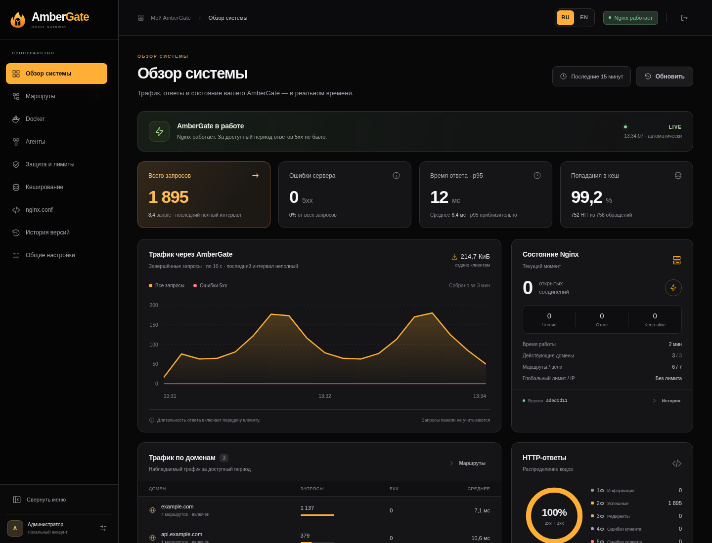
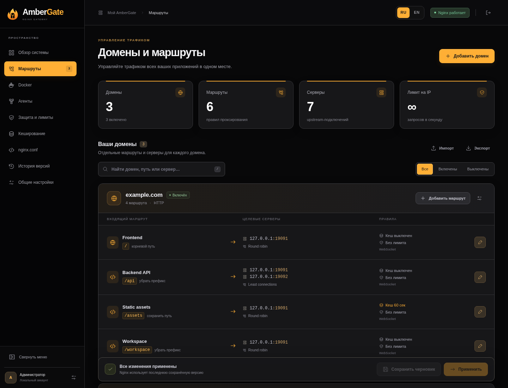
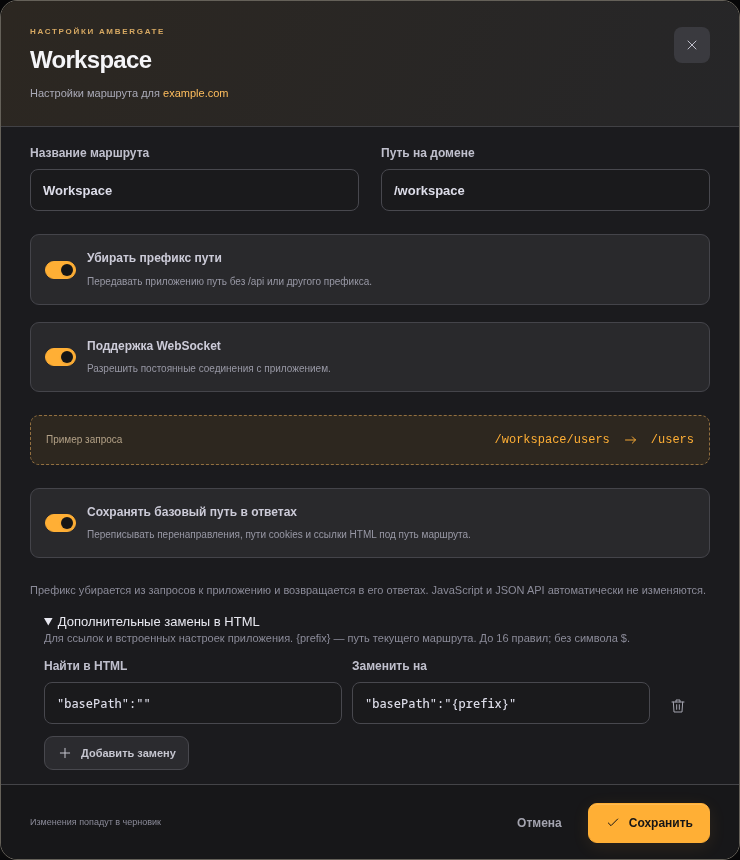
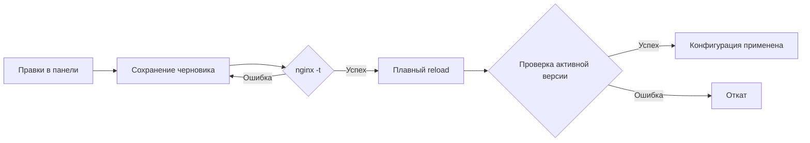

<p align="center"><a href="README.md">English</a> · <strong>Русский</strong></p>

<p align="center"></p>

<p align="center">
  <a href="https://github.com/gadmin2151/ambergate/actions/workflows/docker.yml"></a>
  <a href="https://github.com/gadmin2151/ambergate/pkgs/container/ambergate"></a>
  
</p>

<h3 align="center">Ваши домены. Ваши приложения. Один gateway.</h3>
<p align="center">Управляйте Nginx через веб-интерфейс. Подключайте Docker-машины, распределяйте трафик и следите за работой приложений. Все настройки хранятся на вашем сервере.</p>
<p align="center"><a href="#быстрый-старт">Быстрый старт</a> · <a href="#что-умеет">Возможности</a> · <a href="#удалённые-docker-машины">Агенты</a> · <a href="#переписывание-ответов">Переписывание ответов</a> · <a href="#документация">Документация</a></p>

**AmberGate** — HTTP gateway на базе Nginx, стандартной библиотеки Python и обычного JavaScript. Центральный gateway и панель работают в **одном Docker-контейнере**. Для каждой удалённой Docker-машины можно добавить один контейнер агента. Внешняя база данных и отдельный сервис метрик не нужны; TLS остаётся на вашем reverse proxy.

| Трафик приложений | Панель управления | Конфигурация | Образы |
|:--|:--|:--|:--|
| HTTP · **80** | **8083** · RU / EN | Локальные файлы в **`/data`** | **amd64 / arm64** |

[](docs/screenshots/dashboard.ru.png)
<p align="center"><sub>Настоящий интерфейс на отдельном демонстрационном стенде: примерные домены и локальный тестовый трафик. Производственные данные не используются.</sub></p>

## Что умеет

| Возможность | Что можно настроить |
|:--|:--|
| **Домены и маршруты** | Независимые домены и пути, вложенные префиксы, поиск, включение и отключение доменов |
| **Балансировка** | Round robin, least connections, IP hash, веса и резервные серверы |
| **Переписывание ответов** | Сохранение `/workspace` в перенаправлениях, cookies и HTML-ссылках; дополнительные замены в HTML |
| **Локальный Docker** | Обнаружение через `docker.sock`; общая сеть или опубликованный порт через IP хоста |
| **Удалённые агенты** | Исходящие HTTPS/WSS-туннели, ручной выбор контейнеров и балансировка между машинами без публикации портов |
| **Расширенный доступ агента** | Дополнительный namespace-режим Linux для приватных портов, localhost и контейнеров с `network=none` |
| **Labels в одну строку** | Автоматические маршруты и реплики, группы существующих маршрутов, просмотр или автоматическое применение |
| **Кеш и лимиты** | Кеш публичных GET/HEAD по маршрутам, общий объём на диске, запросы в секунду на IP, burst и ограничения соединений |
| **Защита HTTP** | Размер тела запроса, таймауты, разрешённые методы, защита скрытых файлов и заголовки безопасности |
| **Живой dashboard** | SSE, график трафика, коды ответов, p95, кеш, соединения, статистика доменов и последние ошибки |
| **Применение с проверкой** | Черновики, `nginx -t`, плавный reload, проверка активной версии и откат при ошибке |
| **Локальная история** | Последние 20 версий, восстановление в черновик, JSON-импорт/экспорт и просмотр `nginx.conf` |
| **Удобная панель** | RU / EN, горячие клавиши, диалоги подтверждения, фиксированная боковая панель с прокруткой и сворачиванием |

Запросы с авторизацией, cookies или типовыми подписанными параметрами, ответы с `Set-Cookie` и трафик WebSocket обходят кеш. Учитываются заголовки приложения `Cache-Control` и `Vary`.

## Быстрый старт

### Установка на Linux-сервер

Для **Debian 12/13** и **Ubuntu 22.04/24.04/26.04**, архитектуры amd64 или arm64:

```bash
git clone https://github.com/gadmin2151/ambergate.git
cd ambergate
sudo bash first-start.sh --with-docker
```

Установщик проверяет Docker Engine, Compose plugin, curl, CA-сертификаты и Python 3, устанавливает недостающие компоненты, готовит **`/opt/ambergate`** и ждёт успешного health check. Параметр `--with-docker` монтирует socket для discovery. Пакеты Docker берутся из его официального apt-репозитория; при конфликте пакетов установка останавливается с объяснением.

Начальный пароль появляется один раз в логах с пометкой `AmberGate admin — initial password`. После входа смените его в панели.

```bash
sudo docker compose -f /opt/ambergate/compose.yaml logs ambergate
```

По умолчанию панель привязана к **127.0.0.1:8083**. На своём компьютере откройте туннель к серверу:

```bash
ssh -L 8083:127.0.0.1:8083 user@server
```

Перейдите на **[http://127.0.0.1:8083](http://127.0.0.1:8083)**.

<details>
<summary><strong>Параметры установщика</strong></summary>

| Параметр | Назначение |
|:--|:--|
| `--check` | Проверка без изменений; код 1 при отсутствии или недоступности зависимости |
| `--dir PATH` | Каталог установки; по умолчанию `/opt/ambergate` |
| `--admin-bind IP` | IP панели для нового Compose; по умолчанию `127.0.0.1` |
| `--admin-port PORT` / `--http-port PORT` | Порты панели и приложений; по умолчанию `8083` / `80` |
| `--with-docker` / `--socket PATH` | Монтирование socket; по умолчанию `/var/run/docker.sock` |
| `--no-start` | Подготовка зависимостей и файлов без запуска gateway |

Для **новой** установки в LAN укажите `--admin-bind 10.0.0.10`. Повторный запуск сохраняет существующий Compose, пароль, маршруты и данные; параметры портов и монтирования влияют только на создание нового Compose. Нужен root/sudo. Скрипт может работать отдельно от репозитория. Внешний TLS-прокси он не меняет.

</details>

### Docker уже установлен?

```bash
git clone https://github.com/gadmin2151/ambergate.git
cd ambergate
docker compose -f compose.ghcr.yaml up -d
docker compose -f compose.ghcr.yaml logs ambergate
```

Для сборки из исходников: `docker compose up -d --build`. Перед первым запуском можно скопировать [`.env.example`](.env.example) в `.env` и задать `AMBERGATE_ADMIN_PASSWORD`. Затем пароль меняется в панели.

Если порт 80 занят TLS-прокси, замените публикацию gateway на `127.0.0.1:8080:80` и направьте туда трафик приложений. Панель и API агентов используют отдельный порт **8083**.

## Несколько доменов — один gateway

| Домен | Путь | Назначение |
|:--|:--|:--|
| `example.com` | `/` | Реплики frontend |
| `example.com` | `/api` | Реплики backend, локально или через агентов |
| `example.com` | `/workspace` | Приложение с внешним базовым путём |
| `status.example.com` | `/` | Страница состояния |
| `s3.example.com` | `/` | Стандартный MinIO / S3 API |

**Добавить домен → добавить маршруты → выбрать серверы → Применить.** Префикс маршрута можно сохранить или удалить: при удалении `/back` запрос `/back/api/` поступит приложению как `/api/`. Несколько целей включают балансировку. Домен без маршрутов после применения отвечает 404.

<details>
<summary><strong>Посмотреть экран доменов и маршрутов</strong></summary>



</details>

## Переписывание ответов

Приложение может вернуть `Location: /login`, хотя снаружи оно доступно по `/workspace`. В редакторе маршрута включите **Сохранять базовый путь в ответах**:

| Направление | Пример |
|:--|:--|
| Браузер → приложение | `/workspace/login` превращается в `/login` |
| Перенаправление → браузер | `/login` превращается в `/workspace/login` |
| HTML → браузер | `href="/assets/app.css"` превращается в `href="/workspace/assets/app.css"` |
| Cookie → браузер | `Path=/` превращается в `Path=/workspace/` |

Настройки самого приложения не меняются. Режим работает с прямыми серверами и туннелями агентов, в том числе для HTTPS-клиентов за внешним TLS-прокси. Раздел **Дополнительные замены в HTML** позволяет описать строки конкретного приложения через общий редактор; `{prefix}` подставляет путь маршрута.

<details>
<summary><strong>Посмотреть редактор переписывания ответов</strong></summary>



</details>

Переписывание HTML включается отдельно для маршрута. JS-файлы, JSON API, CSS и все адреса, создаваемые кодом приложения, автоматически не переписываются. Иногда нужны дополнительные правила маршрута или отдельный домен. Подпись стандартного S3 зависит от Host и пути: используйте отдельный домен с `/`, а не переписывание подписанного API. **[Поведение, примеры и ограничения →](docs/response-rewriting.ru.md)**

## Маршруты прямо на Docker-контейнеры

Смонтируйте локальный Docker socket и включите discovery в **Docker → Подключить Docker**:

```bash
docker compose -f compose.ghcr.yaml -f compose.docker.yaml up -d
```

В маршруте откройте **Серверы → Выбрать из Docker**. Локальное обнаружение предпочитает общую Docker-сеть. Другой вариант — сохранить **IP Docker-хоста** и выбрать опубликованный порт: `8001:80` станет `IP-хоста:8001`. Порт, опубликованный только на localhost хоста, недоступен gateway из другой сети.

В общей сети IP контейнеров обновляются через Docker DNS после пересоздания. Можно выбрать несколько контейнеров для балансировки или ввести HTTP-порт вручную, если нет `EXPOSE`. Ручной выбор отслеживает выбранные цели; labels автоматически добавляют новые реплики. Discovery не переносит контейнеры между сетями и не проверяет готовность приложения через HTTP.

Docker socket даёт привилегии на уровне API хоста; монтирование `:ro` не делает сам API доступным только для чтения. AmberGate только читает метаданные Docker. **[Сети, ограничения и права доступа →](docs/configuration.ru.md#docker-socket-и-выбор-контейнеров)**

## Удалённые Docker-машины

Один контейнер **AmberGate Agent** на каждой машине обнаруживает локальные контейнеры и передаёт их трафик через исходящий туннель. **Публиковать порты агента и приложений не нужно.** Маршрутизацией, балансировкой, кешем и лимитами продолжает управлять центральный Nginx.

1. Сохраните адрес центра в **Общих настройках**, например `embergate.exemple.com`.
2. Откройте **Агенты → Добавить агента** и выберите режим подключения.
3. Скопируйте готовую **однострочную команду `docker run`** или скачайте **Docker Compose**.
4. Запустите её на удалённой Docker-машине. Мастер покажет подключение через SSE.
5. В окне выбора контейнеров маршрута переключите **Источник контейнеров** на агента, выберите приложения и примените настройки. Для автоматизации используйте labels.

| Режим агента | Когда подходит |
|:--|:--|
| **Сеть хоста** · по умолчанию | Обычный Docker Engine под Linux; внутренние IP контейнеров разных локальных bridge-сетей без создания новой сети |
| **Конкретная Docker-сеть** | Доступ через существующие общие сети или среда, где режим хоста не подходит |
| **Расширенный доступ · namespace** | Rootful Docker под Linux; подключение из сетевого namespace выбранного контейнера, включая localhost и `network=none` |

Расширенный режим добавляет **доступ к PID хоста**, `SYS_ADMIN`, `SYS_PTRACE` и `AMBERGATE_AGENT_NAMESPACE=true`. Это явно выбираемый режим с широкими правами для доверенных хостов; политики безопасности хоста могут его ограничить. Он не меняет сети приложений и не требует полного `--privileged`. Сначала обновите центральный AmberGate, затем **пересоздайте** агент командой из мастера: простой restart не добавит новые права.

Домен использует **HTTPS/WSS** через внешний TLS-прокси к порту центра **8083**. Просто IP, например `10.0.0.10`, станет `http://10.0.0.10:8083` только после предупреждения и подтверждения; токены и трафик в этом случае не шифруются. Команды с токенами храните приватно.

**[Руководство по агентам →](docs/agents.ru.md)** · **[Обычный Compose](compose.agent.yaml)** · **[Namespace Compose](compose.agent.namespace.yaml)** · **[Пример приложения с агентом](examples/agent.compose.yaml)**

## Автоматические маршруты через Docker labels

**Одна строка** описывает маршрут. Контейнеры с одинаковыми доменом, путём и настройками маршрута попадают в общий балансировщик, в том числе на разных агентах:

```yaml
labels: { ambergate.route: "host=example.com; path=/api; port=3000; strip=true; balance=least_conn" }
```

Для подключения к существующему маршруту задайте в нём **Docker group** `app-api` и используйте:

```yaml
labels: { ambergate.route: "group=app-api; port=3000; weight=2" }
```

Режимы: **Выключено**, **Предлагать изменения**, **Применять автоматически**. Сверка выполняется каждые 5 секунд; изменения проходят проверку и подтверждённый reload. Посторонние правки черновика не применяются. Маршрут без оставшихся целей отвечает 503, чтобы запрос не попал в другое приложение.

**[Полный справочник labels →](docs/docker-labels.ru.md)** · **[Готовые Compose-примеры →](examples/docker-labels.compose.yaml)**

## Живые метрики и применение настроек

Dashboard использует **одно SSE-соединение** со снимками раз в секунду. Он показывает завершённые запросы, скорость, ошибки 5xx, приблизительный p95, кеш, открытые соединения, активность доменов и последние 4xx/5xx. Метрики хранятся в ограниченной локальной памяти до 15 минут и сбрасываются при перезапуске. Запросы панели и health check исключены; без трафика статистика не выдумывается.



**Сохранить черновик** записывает настройки без влияния на трафик; **Применить** проверяет и активирует их. Любую из последних 20 версий можно восстановить в черновик. Смена RU / EN сохраняет незаполненные до конца формы. **`/`** переводит фокус в поиск маршрутов, **`Ctrl/Cmd + S`** сохраняет черновик. Боковая панель прокручивается независимо и запоминает сворачивание; нажатие на логотип открывает dashboard.

## Хранение, резервные копии и обновления

| Содержимое | Путь в контейнере | Путь установщика |
|:--|:--|:--|
| Настройки, маршруты, учётные данные, агенты, привязки туннелей и история | `/data` | `/opt/ambergate/data` |
| Кеш ответов | `/cache` | `/opt/ambergate/cache` |
| Рабочие файлы процессов | `/run/ambergate` | `/opt/ambergate/run` |

Compose из репозитория использует именованные volumes, установщик — каталоги в `/opt/ambergate`. Приватно сохраняйте **весь каталог `/data` и Compose**. Для согласованной копии используйте снимок файловой системы или краткую остановку gateway. JSON маршрутов не переносит аккаунт администратора, агентов и привязки туннелей.

Для установки через скрипт:

```bash
cd /opt/ambergate
sudo docker compose pull
sudo docker compose up -d --wait
```

При запуске из репозитория добавляйте `-f compose.ghcr.yaml` и используемые overlays. Сначала обновляйте центр, затем агентов; предпочтительны одинаковые версии образов. **Не используйте `down -v`**, если данные нужны. Фонового автоматического обновления образов нет.

<details>
<summary><strong>Переход с Nginx Scale Gateway</strong></summary>

Сохраните прежний Compose-проект, service, сети и volumes; замените только образ на `ghcr.io/gadmin2151/ambergate:latest`, затем скачайте образ и пересоздайте контейнер. Новые имена volumes могут создать пустую установку. Маршруты, история, пароль и Docker-настройки совместимы. Прежние переменные `GATEWAY_*` работают, если не заданы соответствующие `AMBERGATE_*`; прежний заголовок кеша и выбор языка тоже поддерживаются.

Установщик обнаруживает старый каталог; передайте `--dir /opt/nginx-scale-gw`, чтобы сохранить его. Переименовывать каталог необязательно. При смене имени контейнера обновите **Docker → Контейнер AmberGate**. После обновления войдите в панель заново.

</details>

## Сборка и публикация

[GitHub Actions](.github/workflows/docker.yml) проверяет установщик, Compose и JavaScript; тестирует маршрутизацию, кеш, авторизацию и переписывание ответов с настоящим Nginx; затем проверяет реальный Docker discovery и агентов через TLS с проверкой сертификата. Проверки агентов охватывают разные сети, namespace-доступ, приложения только на localhost, загрузку данных, пересоздание контейнеров, перезапуск, истечение срока отчётов и отзыв токенов.

Оба образа публикуются для **`linux/amd64` и `linux/arm64`** с OCI-метаданными, provenance и SBOM:

| Образ | Назначение |
|:--|:--|
| [`ghcr.io/gadmin2151/ambergate`](https://github.com/gadmin2151/ambergate/pkgs/container/ambergate) | Центральный gateway и панель |
| [`ghcr.io/gadmin2151/ambergate-agent`](https://github.com/gadmin2151/ambergate/pkgs/container/ambergate-agent) | Удалённое обнаружение Docker и туннель трафика |

Push в `main` публикует `latest` и `sha-<полный-commit-SHA>`. Версионные теги публикуют полную и минорную версии, а также SHA-тег. Pull request запускает проверки без публикации. Используется `GITHUB_TOKEN`; доступ к Docker Hub не нужен.

## Документация

| Руководство | Содержание |
|:--|:--|
| [Настройка агентов](docs/agents.ru.md) | Запуск одной командой, сети, TLS-прокси, токены и лимиты |
| [Docker labels](docs/docker-labels.ru.md) | Все параметры, группы, конфликты, ошибки и примеры |
| [Переписывание ответов](docs/response-rewriting.ru.md) | Перенаправления, cookies, HTML-правила и ограничения |
| [Справочник конфигурации](docs/configuration.ru.md) | Маршруты, кеш, защита, локальная разработка и метрики |
| [Разработка и вклад в проект](CONTRIBUTING.md) | Проверки, структура проекта и переводы |
| [О скриншотах](docs/screenshots/README.md) | Демонстрационный стенд и происхождение изображений |

**Границы возможностей:** HTTP-приложения и WebSocket upgrade. Сертификатами управляет внешний TLS-прокси; upstream HTTPS, gRPC, произвольный TCP и полноценный WAF не реализованы. `nginx.conf` формируется из проверенных полей, произвольного редактирования директив нет. Укажите доверенные IP/CIDR прокси для корректных лимитов по клиентскому IP; администрирование размещайте в доверенной сети или за защищённым внешним прокси.

<p align="center"><br><br><sub>Ваш сервер. Ваш трафик. Ваши правила.</sub></p>
