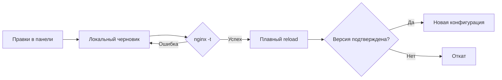

<p align="center"><a href="README.md">English</a> · <strong>Русский</strong></p>

<p align="center">
  
</p>

<p align="center">
  <a href="https://github.com/gadmin2151/ambergate/actions/workflows/docker.yml"></a>
  
  
  
</p>

<p align="center">
  <b>Ваш Nginx. Несколько доменов. Одна удобная панель.</b><br>
  Маршруты, балансировка, кеш и защита приложений — в одном Docker-контейнере.
</p>

<p align="center">
  <a href="#быстрый-старт">Быстрый старт</a> ·
  <a href="#несколько-доменов--один-gateway">Домены и маршруты</a> ·
  <a href="docs/configuration.ru.md">Полная документация</a> ·
  <a href="https://github.com/users/gadmin2151/packages/container/package/ambergate">Docker image</a>
</p>

---

**AmberGate** превращает настройку Nginx в простой процесс: добавьте домен, укажите приложения, проверьте конфигурацию и примените её из браузера. Nginx передаёт трафик напрямую; небольшой Python-сервис отвечает только за управление.

Без внешней БД, frontend-сборки, CDN и облачных зависимостей во время работы. Все настройки и история хранятся локально. **SSL остаётся на вашем внешнем прокси.**

## Что умеет

| Возможность | Что вы получаете |
|:--|:--|
| **Живой dashboard** | График трафика, RPS, задержки, ошибки, кеш, соединения и статистика доменов |
| **Docker labels** | Маршрут одной строкой, автоматическая балансировка реплик, группы, предпросмотр и автоприменение |
| **Docker discovery** | Подключение к docker.sock, выбор контейнеров и TCP-портов для маршрутов и балансировки |
| **Несколько доменов** | Независимые маршруты и upstream для каждого домена; поиск и фильтры |
| **Маршрутизация** | `/`, `/api`, `/s3`, вложенные пути, сохранение или удаление префикса |
| **Балансировка** | Round robin, least connections, IP hash, веса и резервные серверы |
| **Кеш** | TTL на маршрут, общий размер дискового кеша, обход приватных запросов |
| **Защита** | Лимиты на IP, burst, соединения, размер запроса, скрытые файлы и security headers |
| **Работа за SSL-прокси** | Доверенные CIDR, реальный IP клиента, корректная внешняя схема |
| **Безопасное применение** | Проверка `nginx -t`, плавный reload, подтверждение версии и откат |
| **История и перенос** | 20 версий, восстановление, импорт и экспорт JSON |
| **Современная панель** | Чёрно-золотая тема, удобные вкладки, мобильная версия, постоянные кнопки сохранения |

## Удалённые Docker-машины

**AmberGate Agent** — отдельный Docker-контейнер с доступом к `docker.sock` и сетям приложений. Агент сам открывает HTTPS/WSS-туннель в центральный AmberGate; порты агента и приложений публиковать не нужно. Одинаковые labels объединяют контейнеры с разных машин в балансировку.

Один раз задайте адрес в **Общих настройках** (пример: `embergate.exemple.com`), затем откройте **Агенты → Добавить агента**. Мастер подставит адрес и токен в **готовую однострочную команду `docker run`** или **Docker Compose** и покажет подключение через SSE. Домен использует HTTPS через ваш TLS-прокси. Просто IP подключается по HTTP на порту 8083 только после предупреждения и явного подтверждения риска.

Удалённые контейнеры также доступны прямо в **Маршруты → Выбрать из Docker → Источник контейнеров**. Можно объединять разные агенты и локальные серверы в одной балансировке без labels и публикации портов. Боковая панель имеет отдельную прокрутку и запоминает сворачивание до иконок.

**[Настройка агентов →](docs/agents.ru.md)** · **[Compose агента →](compose.agent.yaml)** · **[Полный пример →](examples/agent.compose.yaml)**

## Что происходит с gateway

После входа открывается **«Обзор системы»** — рабочий dashboard в чёрно-янтарной теме. Метрики и статус Nginx поступают через **SSE** раз в секунду по одному постоянному соединению, без периодических HTTP-запросов из браузера.

- **Трафик:** количество запросов, текущая скорость, график за последние 15 минут и объём отданных данных.
- **Ответы:** ошибки 5xx, среднее время ответа, приблизительный p95 и распределение HTTP-кодов.
- **Кеш и защита:** доля HIT и запросы, отклонённые лимитами самого gateway.
- **Nginx:** состояние, время работы, открытые соединения и действующая версия конфигурации.
- **Домены:** запросы, ошибки и задержки отдельно для каждого домена.
- **Проблемные ответы:** последние 30 ответов 4xx/5xx с доменом, маршрутом и длительностью.

Это реальные измерения завершённых HTTP-запросов. Пока трафика нет, dashboard показывает ожидание данных. Запросы админки и служебные проверки не попадают в статистику трафика. Черновик и действующие настройки обозначены отдельно.

При обрыве связи панель обозначает последний снимок и автоматически переподключается. При возврате в скрытую вкладку открывается новый поток с актуальными данными; выход из аккаунта и истечение сессии закрывают соединение. Редактирование маршрутов и настроек не прерывается обновлениями dashboard.

Метрики собираются локально в ограниченной памяти, без дополнительных контейнеров, файлов журналов или внешних сервисов. История сбрасывается при перезапуске; подробности расчёта и ограничения описаны в [документации dashboard](docs/configuration.ru.md#dashboard-и-метрики).

## RU / EN

Переключатель **RU / EN** доступен на странице входа и в верхней панели. Язык сохраняется в браузере; тексты, подсказки, диалоги, ошибки, даты и числа переключаются без перезагрузки. Названия маршрутов, домены и адреса серверов остаются вашими. Несохранённые поля сохраняются при смене языка.

## Быстрый старт

### Автоматическая установка на сервер

Для **Debian 12/13** и **Ubuntu 22.04/24.04/26.04**, архитектуры **amd64 / arm64**:

```bash
git clone https://github.com/gadmin2151/ambergate.git
cd ambergate
sudo bash first-start.sh --with-docker
```

Скрипт проверяет Docker Engine, Compose plugin, curl, сертификаты и Python 3; устанавливает недостающие пакеты, запускает Docker при необходимости и ждёт health check gateway. Установка использует официальный apt-репозиторий Docker. Существующие пакеты не удаляются; при конфликте выводится причина.

Всё размещается в `/opt/ambergate`: `compose.yaml`, `data/`, `cache/`, `run/`. Панель по умолчанию доступна только на `127.0.0.1:8083`, gateway — на порту `80`. Начальный пароль выводится один раз в логах контейнера:

```bash
sudo docker compose -f /opt/ambergate/compose.yaml logs ambergate
```

Для доступа из доверенной сети на **новой** установке:

```bash
sudo bash first-start.sh --admin-bind 10.0.0.10 --with-docker
```

| Параметр | Назначение |
|:--|:--|
| `--check` | Только проверить компоненты, ничего не устанавливать |
| `--dir /opt/ambergate` | Каталог установки |
| `--admin-bind 127.0.0.1` | IP панели при создании Compose |
| `--admin-port 8083` / `--http-port 80` | Порты новой установки |
| `--with-docker` | Смонтировать socket; discovery включается в панели |
| `--socket /var/run/docker.sock` | Путь к локальному Docker socket |
| `--no-start` | Подготовить зависимости и файлы без запуска gateway |

Повторный запуск сохраняет существующий `compose.yaml`, пароль, маршруты и данные. Параметры портов и socket-монтирования применяются только при создании Compose. Для обновления существующей установки используйте `docker compose pull`, затем `up -d` в её каталоге. Если Compose ещё нет, а в каталоге уже лежат данные, они используются без перезаписи.


### Готовый образ из GitHub Container Registry

```bash
git clone git@github.com:gadmin2151/ambergate.git
cd ambergate
docker compose -f compose.ghcr.yaml up -d
docker compose -f compose.ghcr.yaml logs ambergate
```

Откройте **[http://127.0.0.1:8083](http://127.0.0.1:8083)**. Начальный случайный пароль появится один раз в логах: `AmberGate admin — initial password`.

| Назначение | Адрес / хранение |
|:--|:--|
| Трафик приложений | HTTP, порт **80** |
| Панель управления | Порт **8083**, опубликован на loopback хоста |
| Настройки и история | Volume `ambergate-data` → `/data` |
| Кеш | Volume `ambergate-cache` → `/cache` |
| Образ | `ghcr.io/gadmin2151/ambergate:latest` |

При желании скопируйте `.env.example` в `.env` и задайте `AMBERGATE_ADMIN_PASSWORD` перед первым запуском. После создания аккаунта пароль меняется в панели.

### Сборка самостоятельно

```bash
docker compose up -d --build
docker compose logs ambergate
```

> Если порт 80 уже занят вашим SSL-прокси, замените публикацию на `127.0.0.1:8080:80` и направьте прокси на порт 8080. Для доступа к панели удалённого сервера: `ssh -L 8083:127.0.0.1:8083 user@server`.

## Маршруты прямо на Docker-контейнеры

Подключение Docker необязательно. Чтобы выбирать контейнеры в панели, добавьте socket через готовый Compose overlay:

```bash
docker compose -f compose.ghcr.yaml -f compose.docker.yaml up -d
```

Для сборки из исходников используйте `compose.yaml` вместо `compose.ghcr.yaml`. Если socket находится в другом месте, укажите `DOCKER_SOCKET_PATH` в `.env` — например `/run/user/1000/docker.sock` для rootless Docker.

1. Откройте **Docker → Подключить Docker**. Путь внутри контейнера по умолчанию — `/var/run/docker.sock`.
2. Подключите приложения и gateway к общей пользовательской сети Docker, например `ambergate`.
3. При создании домена или в **Маршрут → Серверы → Выбрать из Docker** отметьте нужные контейнеры и порты.
4. Настройте Round robin / Least connections, веса и резервные цели. Сохраните маршрут и нажмите **«Применить»**.

**Контейнеры из другой сети:** в окне выбора укажите **IP Docker-хоста**, нажмите **«Сохранить IP»** и выберите **«Через IP хоста»**. Для публикации `8001:80` в маршрут попадёт `IP-хоста:8001`. В режиме **«Автоматически»** сначала используется общая сеть, а при её отсутствии — опубликованный порт хоста. IP можно также сохранить в разделе Docker; он хранится локально. Порты, опубликованные только на `127.0.0.1` или `::1` хоста, недоступны gateway из отдельного контейнера.

В пользовательской сети сохраняются Docker-имена, а Nginx обновляет их IP через Docker DNS. Для пересоздания контейнера с тем же именем менять маршрут не требуется. Окно выбора создаёт ручные цели. Для автоматического добавления и удаления реплик включите Docker labels, как описано ниже. Локальная панель вне контейнера предлагает опубликованные TCP-порты хоста.

Панель показывает сеть, состояние, образ и порты, отмечает остановленные контейнеры и отсутствие общей сети. Если приложение не объявило порт, его можно ввести вручную. **Нужен HTTP-порт приложения; discovery не проверяет протокол.**

Docker socket даёт привилегированный доступ к Docker-хосту. AmberGate использует только GET-запросы для обнаружения; монтирование `:ro` не делает сам Docker API доступным только для чтения. [Настройка сетей, ограничения и права доступа →](docs/configuration.ru.md#docker-socket-и-выбор-контейнеров)

## Автоматические маршруты через Docker labels

**Одна строка** создаёт домен, маршрут и балансировщик. Запущенные контейнеры с одинаковыми `host` и `path` автоматически попадают в один upstream:

```yaml
labels: { ambergate.route: "host=example.com; path=/api; port=3000; strip=true; balance=least_conn" }
```

Смонтируйте socket через `compose.docker.yaml`, подключите Docker в панели, затем выберите режим в блоке **Маршруты из Docker labels**:

- **Выключено** — исходный режим; уже созданные маршруты сохраняются.
- **Предлагать изменения** — просмотр найденных маршрутов и серверов, затем кнопка **Применить найденное**.
- **Применять автоматически** — проверка каждые **5 секунд**: запуск, остановка, удаление и изменение числа реплик. Статус поступает в интерфейс через SSE.

Перед каждым изменением выполняются `nginx -t` и проверенный graceful reload; при ошибке — откат. Без изменений reload не выполняется. Рабочая конфигурация и сохранённый черновик обновляются отдельно: чужие неприменённые правки не попадут в работающий Nginx. Сохранение редактора защищено проверкой версии; устаревший редактор нужно обновить.

### Подключение к существующему маршруту

В редакторе маршрута откройте **Серверы**, задайте **Docker group** `app-api`, сохраните и примените. Ручные серверы можно оставить или удалить, чтобы использовать только контейнеры из группы:

```yaml
labels: { ambergate.route: "group=app-api; port=3000; weight=2" }
```

Группа наследует балансировку, кеш и защиту маршрута. Labels `host`/`path` не перезаписывают ручной маршрут с таким же доменом и путём — для этого используйте `group`. Отсутствие подходящего маршрута для группы показывается в панели. Одна группа может использоваться несколькими маршрутами.

### Доступные параметры

Поля `key=value` разделяются `;`. Неизвестные ключи, повторения и неверные значения отклоняются. Логические значения — только `true` и `false`.

| Ключ | Назначение / значение по умолчанию |
|:--|:--|
| `host` | Домен; обязателен без `group`; один домен в одном label |
| `path` | По умолчанию `/`; например `/api`, `/v1/api`, без завершающего `/` |
| `port` | **Обязательный HTTP-порт внутри контейнера**, 1–65535; в общей сети `EXPOSE` не нужен |
| `group` | Добавить сервер к маршрутам с такой группой; 1–64 буквы, цифры, `_`, `-`; вместо `host`/`path` |
| `via` | `network` — общая Docker-сеть (по умолчанию); `host` — опубликованный порт через IP Docker-хоста |
| `balance` | `round_robin` (по умолчанию), `least_conn`, `ip_hash` |
| `strip` | Убирать префикс пути; по умолчанию `false` |
| `cache` | Кеш публичных GET/HEAD; по умолчанию `false`; исключения для cookies, авторизации и подписанных запросов сохраняются |
| `ttl` | Время кеширования, 1–604800 секунд; по умолчанию `60` |
| `websocket` | Передавать Upgrade; по умолчанию `true` |
| `timeout` | Таймаут чтения/отправки upstream, 1–3600 секунд; по умолчанию `60` |
| `body` | Размер тела запроса, 0–102400 MiB; `0` наследует глобальный лимит |
| `rate` | Дополнительный лимит запросов/сек на IP для маршрута, 0–100000; `0` оставляет только глобальный лимит |
| `burst` | Всплеск для лимита маршрута, 0–100000; по умолчанию `0` |
| `weight` | Вес этого контейнера, 1–1000; по умолчанию `1` |
| `backup` | Резервный сервер, по умолчанию `false`; несовместим с `ip_hash` |

В режиме `group` доступны только `group`, `port`, `via`, `weight`, `backup`. У контейнеров с одинаковыми `host` + `path` настройки маршрута должны совпадать; порты, способы подключения и веса могут различаться. Глобальные настройки Nginx, доверенные прокси и TLS через labels не задаются.

Для контейнера в другой сети опубликуйте порт и сохраните **IP Docker-хоста** в панели:

```yaml
ports: ["8001:80"]
labels: { ambergate.route: "host=storage.example.com; port=80; via=host" }
```

AmberGate сам сопоставит внутренний порт `80` с опубликованным `8001`. Конкретный адрес привязки сохраняется; публикация только на localhost недоступна из другого контейнера. `via=network` не переключается на порт хоста автоматически.

Несколько маршрутов одного контейнера задаются именованными labels:

```yaml
labels:
  ambergate.route.api: "host=example.com; path=/api; port=3000"
  ambergate.route.admin: "host=admin.example.com; port=3001"
```

**[Готовый Compose с примерами →](examples/docker-labels.compose.yaml)** — frontend, масштабируемый API, кеш, разные домены, группы, резервные серверы и другая сеть.

Обнаруживаются запущенные контейнеры; активной HTTP-проверки готовности и фильтрации по Docker HEALTHCHECK нет. Остановленные и удалённые контейнеры исключаются из обнаруженных серверов. Когда у маршрута не осталось ручных или обнаруженных серверов, он сохраняется и отвечает **503**, чтобы запрос не попал в другое приложение. Для полного удаления уберите label, пересоздайте контейнер, затем удалите сохранённый маршрут в панели. Настройки маршрута, созданного labels, в редакторе доступны только для просмотра.

Неверные локальные labels или противоречивые настройки приостанавливают обновление, сохраняя последнюю рабочую конфигурацию. Неполный список или недоступный локальный Docker сохраняет его цели; ошибки удалённых отчётов обрабатываются по таймаутам агентов. Ограничения: 16 labels на контейнер, 4096 символов на label, 32 сервера на маршрут, 50 маршрутов на домен, 100 доменов. Список из 500 контейнеров считается неполным. Всё хранится локально: `/data/docker.json`, `/data/labels.json`, черновики и версии конфигурации. Отключение labels сохраняет текущие маршруты без дальнейшего обновления. Если настроены агенты, отключение локального Docker сохраняет только локальные цели; удалённые продолжают синхронизироваться. При включённой автоматизации право создавать контейнеры с labels на этом Docker daemon позволяет влиять на маршрутизацию; используйте доверенные контейнеры.

## Несколько доменов — один gateway

Каждый домен имеет собственный набор маршрутов. Например:

| Домен | Путь | Приложение |
|:--|:--|:--|
| `example.com` | `/` | `frontend-1:3000`, `frontend-2:3000` |
| `example.com` | `/api` | `backend-1:8000`, `backend-2:8000` |
| `example.com` | `/s3` | HTTP-хранилище, принимающее этот путь |
| `app2.example.com` | `/` | `other-frontend:3000` |
| `app2.example.com` | `/api` | `other-backend:8000` |
| `s3.example.com` | `/` | `minio:9000` — стандартный S3 API |

1. Нажмите **«Добавить домен»** и укажите имя и первый upstream.
2. Добавьте маршруты. Во вкладке **«Серверы»** настройте балансировку; в **«Кеш и лимиты»** — правила маршрута.
3. Добавьте следующий домен тем же способом. Настройки доменов независимы.
4. Нажмите **«Применить»**. Сервис проверит и загрузит конфигурацию.

Удаление маршрутов и доменов подтверждается в панели. После удаления нажмите **«Сохранить черновик»** или **«Применить»**. Последний маршрут тоже можно удалить: домен останется и после применения будет отвечать HTTP 404 до добавления нового маршрута.

В пустой панели есть готовый пример для `example.com`. Замените адреса примера своими. Приложения должны быть доступны из сети контейнера: Compose создаёт сеть `ambergate`; подключите к ней контейнеры приложений или используйте доступные IP.

**S3:** SigV4 зависит от исходного пути и Host. Стандартный MinIO/S3 API лучше вынести на отдельный домен с маршрутом `/`; удаление `/s3` может нарушить подпись. [Подробности →](docs/configuration.ru.md#s3-и-префикс-s3)

## Как применяются изменения



**Сохранить черновик** записывает настройки, не меняя текущий трафик. **Применить** сохраняет, проверяет и активирует их. Черновик и действующая конфигурация переживают перезапуск независимо друг от друга.

В панели можно нажать **`/`**, чтобы перейти к поиску, и **`Ctrl/Cmd + S`**, чтобы сохранить черновик. Вкладки редактора поддерживают клавиатуру.

## Сборка и публикация образа

[GitHub Actions](.github/workflows/docker.yml) автоматически:

1. Проверяет JavaScript и Compose, собирает Docker-образ.
2. Запускает тесты с настоящим Nginx **внутри образа** и проверяет запуск контейнера.
3. Проверяет discovery через настоящий Docker socket, балансировку двух контейнеров и обновление DNS после пересоздания контейнера с другим IP.
4. После успешных проверок публикует образ в **GHCR** для `linux/amd64` и `linux/arm64`, с OCI-метаданными, provenance и SBOM.

| Событие | Результат |
|:--|:--|
| Push в `main` | Проверки, публикация `latest` и `sha-<полный commit SHA>` |
| Тег `v1.2.3` | Проверки, публикация `1.2.3`, `1.2` и SHA-тега |
| Pull request | Проверки без публикации |
| Ручной запуск workflow | Проверки; публикация только из `main` или тега `v*` |

Используется встроенный `GITHUB_TOKEN` с `packages: write`; отдельные Docker Hub credentials не нужны. Actions закреплены полными commit SHA. Новые GHCR packages могут изначально иметь видимость private — для анонимного `docker pull` установите public в настройках package.

Обновление установленного сервиса:

```bash
docker compose -f compose.ghcr.yaml pull
docker compose -f compose.ghcr.yaml up -d
```

## Переход на AmberGate

Проект **Nginx Scale Gateway** переименован в **AmberGate**. Для существующей установки сохраните резервную копию `/data` и Compose, затем замените только `image` в **вашем действующем Compose** на `ghcr.io/gadmin2151/ambergate:latest`. В прежнем каталоге выполните `docker compose pull && docker compose up -d --wait`. Сохраните имя Compose-проекта, service, сети и подключения data/cache: новые имена из примеров могут создать пустые volumes. Не используйте `down -v`.

Маршруты, история, пароль и Docker-настройки совместимы. Новые переменные имеют префикс `AMBERGATE_*`; прежние `GATEWAY_*` поддерживаются, если соответствующая новая переменная не задана. Новый runtime-каталог — `/run/ambergate`, прежний `GATEWAY_RUN_DIR` продолжает работать. Заголовок кеша — `X-AmberGate-Cache`, прежний `X-Gateway-Cache` остаётся совместимым алиасом. Выбор языка переносится автоматически; после обновления войдите в панель заново.

Новые установки создаются в `/opt/ambergate`. Если найден прежний каталог, установщик предложит обновить его на месте; передайте `--dir /opt/nginx-scale-gw`. Переименовывать каталог необязательно. При смене имени контейнера обновите сохранённое поле **Docker → Контейнер AmberGate**.

## Разработка и проверки

```bash
python3 -m unittest tests.test_config -v
node --check ambergate/static/app.js
node --check ambergate/static/dashboard.js
node --check ambergate/static/docker.js
docker compose config --quiet
```

Полный набор проверяет маршруты и их границы, несколько доменов, алгоритмы балансировки, резервные серверы, WebSocket upgrade, кеш и приватные ответы, IP-лимиты, auth/CSRF, историю и откат. Проверки dashboard включают реальный трафик, метрики кеша и ошибок, ограничение памяти, исключение служебных запросов и обновление старой конфигурации с сохранением черновика.

```bash
docker compose build
docker run --rm --entrypoint python3 \
  -v "$PWD/tests:/app/tests:ro" \
  local/ambergate:latest -m unittest discover -v
```

Интеграционные тесты требуют Nginx 1.28+; без него они помечаются как skipped. [Локальный запуск без Docker и полное описание настроек →](docs/configuration.ru.md#разработка-и-проверки)

## Важно при настройке

- За внешним SSL-прокси укажите его **доверенный IP/CIDR**: иначе пользователи разделят лимит IP прокси.
- Кешируйте только публичные ответы. Authorization, cookies, Set-Cookie и типовые подписанные параметры исключены из кеша.
- Это **HTTP gateway**, а не WAF, TCP-прокси или TLS-менеджер. Upstream HTTPS и gRPC пока не поддерживаются.
- Произвольное редактирование директив не предусмотрено: `nginx.conf` генерируется из проверенных полей панели.
- Сохраняйте volume `/data`; `docker compose down -v` удаляет настройки вместе с volumes.

<p align="center"><br><br><sub>Small by design. Yours by default.</sub></p>
