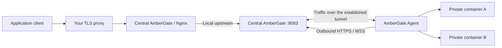

# AmberGate Agent

[Русский](agents.ru.md) · [Back to README](../README.md)

Run one **Docker container per remote machine**, with access to its Docker socket and application networks. The agent discovers containers and `ambergate.route` labels, then opens outbound HTTPS/WSS connections to central AmberGate. Applications and the agent need **no published ports**.



Nginx still controls hosts, paths, balancing, caching and limits. The agent streams upstream HTTP traffic over the tunnel, including uploads, SSE and application WebSocket upgrades. It is not a general-purpose network VPN or public TCP forwarder.

## Connect a machine

1. Upgrade central AmberGate, then open **Agents → Add agent**. Give the machine a name and choose its disconnect timeout (default 30 seconds).
2. Enter your central panel's **HTTPS origin**, such as `https://gateway.example.com`. This address must forward to central port **8083**, not the application listener on port 80.
3. Enter an **existing application Docker network**. Download the generated `compose.agent.yaml`. It includes the new token, which is displayed only once; do not commit this file to Git.
4. Transfer that file to the remote Docker machine and run:

   ```bash
   chmod 600 compose.agent.yaml
   docker compose -f compose.agent.yaml up -d
   docker compose -f compose.agent.yaml logs --tail=50
   ```

5. Add route labels to your applications and recreate those containers. Select **Preview** or **Apply automatically** in the label automation card on the Agents page. The same automation policy controls local Docker and all remote agents; it defaults to **Off**.

Alternatively, use the repository's [compose.agent.yaml](../compose.agent.yaml). Set `AMBERGATE_SERVER_URL`, `AMBERGATE_AGENT_TOKEN` and `AMBERGATE_AGENT_NETWORK` in a private `.env` file before starting it. The network must exist and provide outbound connectivity. An `internal: true` network alone cannot reach the central server; attach the agent to an additional network with egress.

The image is `ghcr.io/gadmin2151/ambergate-agent:latest` for amd64 and arm64. Agent and central images are built from the same revision; prefer matching versions.

## Compact labels, private container ports

```yaml
services:
  backend:
    image: your-backend:latest
    networks: [applications]
    labels:
      ambergate.route: "host=example.com; path=/api; port=3000; strip=true"
    # No ports: block required. 3000 is the application's private HTTP port.

networks:
  applications:
    external: true
    name: ambergate-apps
```

Run replicas with the **same host, path and route options** on several machines. Central AmberGate combines their tunnel targets in a single Nginx upstream. `weight`, `backup` and the supported balancing algorithms work as with local labels.

To extend a manually configured route, set its **Docker group** to `app-api` and use:

```yaml
labels:
  ambergate.route: "group=app-api; port=3000; weight=2"
```

[All label options and examples](../README.md#label-reference) also apply, except `via=host`: remote agents use private Docker network endpoints. Omit `via`, or set `via=network`. Connect the agent to every network that contains a labelled application; it cannot join networks or publish ports by itself.

[Complete application + agent Compose example](../examples/agent.compose.yaml).

## External TLS proxy

Use your existing TLS reverse proxy. It must allow WebSocket upgrades and preserve the `Authorization` header for `/api/agents/`. For Nginx, inside your **existing TLS server**:

```nginx
location / {
    proxy_pass http://10.0.0.10:8083; # Central AmberGate admin listener
    proxy_http_version 1.1;
    proxy_set_header Host $host;
    proxy_set_header X-Forwarded-Proto $scheme;
    proxy_set_header Upgrade $http_upgrade;
    proxy_set_header Connection "upgrade";
    proxy_read_timeout 90s;
    proxy_send_timeout 90s;
    proxy_buffering off; # Also keeps the panel's SSE live
}
```

Change `10.0.0.10` to your central server. Configure certificates in that proxy as usual. HTTPS origins only: URL path prefixes, redirecting login gateways and HTTP redirects are not supported for agents. If the panel is behind SSO, let `/api/agents/connect`, `/api/agents/tunnel/*` and `/api/agents/report` use AmberGate's own bearer-token authentication; retain your existing protection for the rest of the panel. Agent tokens never authenticate admin API calls.

For a private CA, mount its PEM bundle in the agent and set `AMBERGATE_AGENT_CA_FILE=/run/secrets/ca.pem`. Certificate and hostname verification stay enabled. There is no insecure TLS switch.

## State, revocation and failures

- Inventory is reported every 5 seconds. The panel receives agent status through its existing **SSE stream**. Container details show the latest received inventory when opened.
- Healthy, reachable, labelled containers become targets. Invalid labels, an incomplete inventory or loss of Docker access preserve that agent's last valid report until its lease expires.
- In **Auto** mode, expired agents are removed on the next reconciliation (up to 5 additional seconds). Other agents and manually configured targets remain. An empty managed route returns **503**.
- **Preview** proposes configuration changes; **Off** leaves configuration unchanged. Tunnel disconnection still fails upstream connections immediately, allowing Nginx to try a remaining healthy target.
- Disabling, deleting or rotating a token immediately disconnects that agent's tunnel and rejects the old token. Rotation requires updating and restarting the remote agent.
- Agents reconnect automatically after a central restart. Stable local upstream mappings survive restarts and container recreation by name. They are never reassigned to another application, so old configuration history cannot accidentally route to an unrelated target.
- Central stores token **hashes**, inventory, source ownership and port mappings under `/data`. Back up the complete data directory. Agent tokens must be saved separately on their remote machines.

## Settings and limits

| Agent environment variable | Default / purpose |
|---|---|
| `AMBERGATE_SERVER_URL` | Required HTTPS origin of central admin listener |
| `AMBERGATE_AGENT_TOKEN` | Per-agent token generated in the panel |
| `AMBERGATE_AGENT_TOKEN_FILE` | Optional mounted secret file; takes precedence over the environment token |
| `AMBERGATE_DOCKER_SOCKET` | `/var/run/docker.sock` |
| `AMBERGATE_DOCKER_CONTAINER` | Optional own container name/ID if automatic hostname detection is unavailable |
| `AMBERGATE_AGENT_CA_FILE` | Optional PEM CA bundle |
| `AMBERGATE_AGENT_INTERVAL` | 5 seconds; allowed 2–30, keep below the configured lease timeout |
| `AMBERGATE_AGENT_ALLOW_HTTP` | `false`; explicitly opt in only for an isolated development test |

Initial bounds: **32 agents**, **32 simultaneous upstream TCP streams per agent**, **128 total tunnel streams**, **500 containers per report**, **1 MiB per report**, and **1024 retained tunnel target mappings**. Normal route limits also apply (32 combined targets per route). Idle upstream keepalives expire after 5 seconds for routes using remote agents. Each active stream uses an outbound WebSocket; long-lived SSE and WebSocket application connections count toward the stream limit.

The agent reads only Docker metadata needed for inventory and routing; environment variables, mounts and unrelated labels are not reported. Docker socket access still grants privileged host access at the API level: a `:ro` bind mount does not enforce read-only Docker operations. Run agents only on trusted machines and keep their tokens private.
