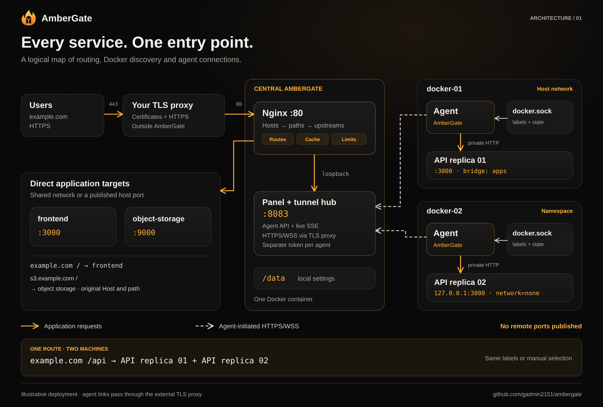
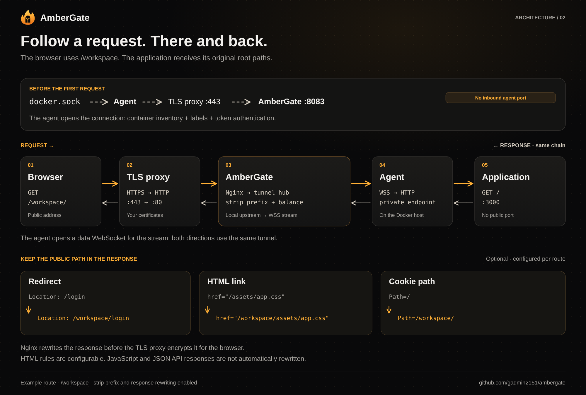

# How AmberGate services connect

[Русский](architecture.ru.md) · [README](../README.md)

These maps illustrate an example deployment. They explain the current architecture; they are not screenshots of a live topology view or a discovered production network.

## 1. Service map

[Download PNG](diagrams/service-map.en.png) · [Scalable SVG](diagrams/service-map.en.svg)

The central gateway is **one Docker container** with Nginx, the web panel, agent API and tunnel hub. It routes directly to reachable local services, or through **one agent container per remote Docker machine**. In this example, `/api` balances two API replicas on different machines, while the frontend and object storage use direct upstreams.

| Connection | Purpose |
|:--|:--|
| Client → external TLS proxy → Nginx **:80** | Public application requests; certificates live on your existing proxy |
| Agent → external TLS proxy **:443** → central API **:8083** | Agent-initiated HTTPS/WSS, bearer-token authentication, inventory and tunnel streams |
| Browser → panel **:8083**, optionally through the TLS proxy | Administration and live SSE updates |
| Nginx → tunnel hub over **loopback** | Internal per-target listeners map a route's upstream to a remote container; these ports are not published |
| Agent → local **docker.sock** | Read container metadata, labels and state |
| Agent → private application port | HTTP traffic to the selected container; application ports need not be published |
| Central services → **/data** | Local configuration, identities, tunnel mappings and history |

Dashed agent links in the map show **who opens the connection**. They pass through the external TLS proxy even though the logical map connects them directly to the central API. Application traffic can travel in both directions over an agent-initiated stream. Docker socket reads are metadata access, not application traffic.

The first agent uses host networking to reach local bridge networks. The second uses optional extended namespace access to reach a localhost-only application inside `network=none`. Namespace mode requires the documented Linux permissions; it does not publish ports or change application networks. See the [agent setup guide](agents.md#extended-namespace-access-linux).

## 2. A request and its response

[Download PNG](diagrams/request-flow.en.png) · [Scalable SVG](diagrams/request-flow.en.svg)

1. The agent reads Docker inventory and registers with the center through its outbound control connection.
2. The browser requests `https://example.com/workspace/`. The external proxy terminates TLS and forwards the request to Nginx.
3. Nginx selects the domain, route and upstream. With prefix stripping enabled, the application receives `/`.
4. For a remote target, the tunnel hub asks the connected agent to open the selected application connection. The agent opens an outbound data WebSocket; request and response bytes use that stream.
5. The response returns through the same chain. If response rewriting is enabled, Nginx restores `/workspace` in supported redirects, cookie paths and HTML links before the external proxy encrypts the response for the browser.

Response rewriting is configurable per route. It does not infer every URL generated by JavaScript or rewrite arbitrary JSON APIs. [Rules and compatibility limits](response-rewriting.md).

For HTTPS agent connections, the central address is the **panel/API origin**, such as `https://ambergate.exemple.com`, routed to **8083**. It is distinct from the application listener on **80**. An explicitly confirmed HTTP/IP installation uses HTTP/WS instead; that optional unencrypted mode is not shown in these diagrams.
