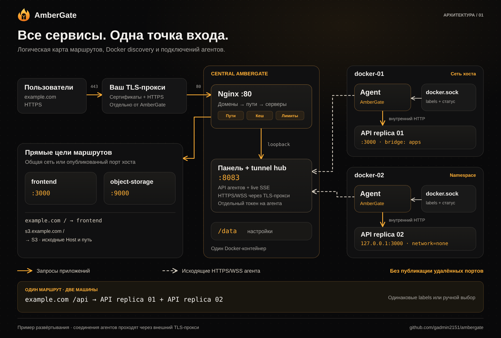
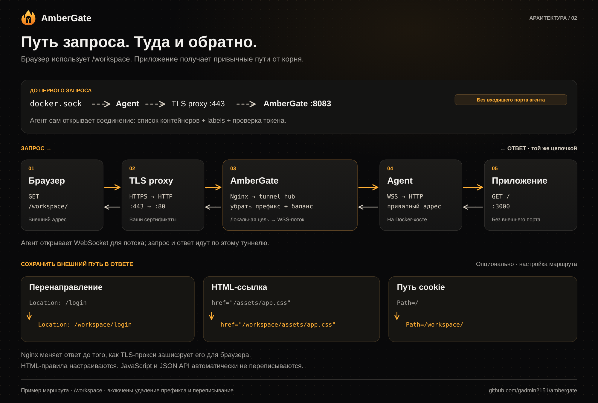

# Как подключаются сервисы AmberGate

[English](architecture.md) · [README](../README.ru.md)

На схемах показан пример развёртывания. Они объясняют текущую архитектуру; это не скриншоты живой карты сети и не результат обнаружения производственных сервисов.

## 1. Карта сервисов

[Скачать PNG](diagrams/service-map.ru.png) · [Векторный SVG](diagrams/service-map.ru.svg)

Центральный gateway — **один Docker-контейнер** с Nginx, панелью, API агентов и узлом туннелей. Он направляет запросы напрямую к доступным локальным сервисам либо через **один контейнер агента на каждой удалённой Docker-машине**. В примере `/api` балансирует между двумя репликами API на разных машинах, а frontend и хранилище подключены напрямую.

| Соединение | Назначение |
|:--|:--|
| Клиент → внешний TLS-прокси → Nginx **:80** | Запросы к приложениям; сертификаты остаются на вашем прокси |
| Агент → внешний TLS-прокси **:443** → API центра **:8083** | Исходящие HTTPS/WSS, проверка токена, инвентарь и потоки туннеля |
| Браузер → панель **:8083**, при необходимости через TLS-прокси | Администрирование и обновления через SSE |
| Nginx → узел туннелей через **loopback** | Внутренний порт каждой цели связывает upstream маршрута с удалённым контейнером; эти порты не публикуются |
| Агент → локальный **docker.sock** | Чтение метаданных, labels и состояния контейнеров |
| Агент → приватный порт приложения | HTTP-трафик к выбранному контейнеру; публиковать порт приложения не нужно |
| Компоненты центра → **/data** | Локальная конфигурация, идентификаторы, привязки туннелей и история |

Пунктирные линии агентов показывают, **кто открывает соединение**. Они проходят через внешний TLS-прокси, хотя на логической карте соединены непосредственно с API центра. Трафик приложений передаётся в обе стороны по потоку, открытому агентом. Чтение Docker socket — отдельный обмен метаданными, через него запросы приложений не идут.

Первый агент использует сеть хоста для доступа к локальным bridge-сетям. Второй — дополнительный namespace-режим для приложения, слушающего только localhost внутри `network=none`. Для него нужны описанные в руководстве права Linux; сети приложений не меняются, порты не публикуются. См. [настройку агента](agents.ru.md#расширенный-доступ-через-namespace-linux).

## 2. Запрос и обратный ответ

[Скачать PNG](diagrams/request-flow.ru.png) · [Векторный SVG](diagrams/request-flow.ru.svg)

1. Агент читает список контейнеров Docker и подключается к центру по исходящему управляющему соединению.
2. Браузер запрашивает `https://example.com/workspace/`. Внешний прокси завершает TLS и передаёт запрос в Nginx.
3. Nginx выбирает домен, маршрут и сервер. При включённом удалении префикса приложение получает `/`.
4. Для удалённой цели узел туннелей просит подключённого агента открыть соединение к выбранному приложению. Агент открывает исходящий WebSocket для данных; запрос и ответ передаются по нему.
5. Ответ возвращается по той же цепочке. Если включено переписывание, Nginx добавляет `/workspace` к поддерживаемым перенаправлениям, путям cookies и HTML-ссылкам до шифрования ответа внешним TLS-прокси.

Переписывание настраивается отдельно для маршрута. Оно не определяет автоматически все адреса, создаваемые JavaScript, и не меняет произвольные JSON API. [Правила и ограничения совместимости](response-rewriting.ru.md).

При HTTPS-подключении агента адрес центра — это **адрес панели/API**, например `https://ambergate.exemple.com`, направленный на **8083**. Он отличается от порта приложений **80**. После явного подтверждения риска можно использовать HTTP/IP с HTTP/WS; этот дополнительный незашифрованный режим на схемах не показан.
