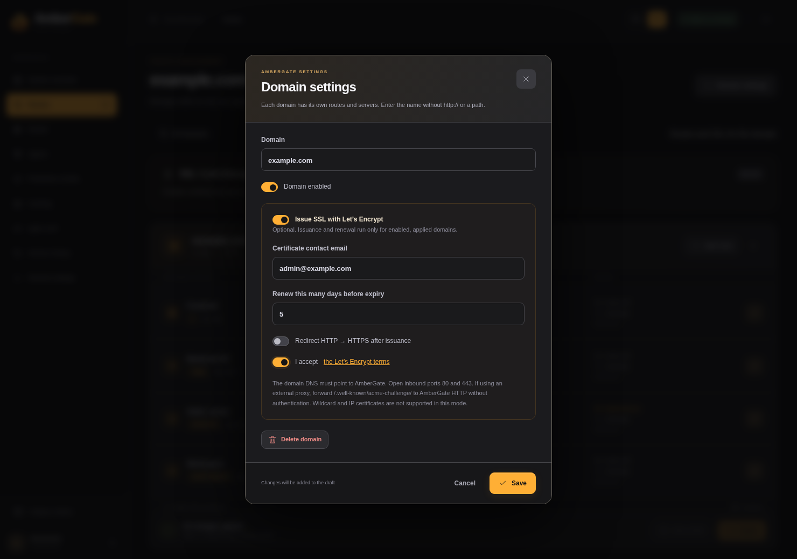

# Optional SSL with Let’s Encrypt

[Русский](ssl.ru.md) · [Back to the README](../README.md)

AmberGate can issue and terminate HTTPS for each application domain. **It is off by default.** Existing HTTP routes and external TLS proxies continue to work without requesting certificates.

## Enable it for a domain

1. Point the domain’s public DNS A/AAAA records to the gateway. Every published address must reach the gateway correctly.
2. Make public **TCP 80** reach AmberGate’s HTTP listener. Let’s Encrypt uses `/.well-known/acme-challenge/` for HTTP-01 validation. Keep this path reachable for renewals too.
3. Publish **TCP 443** for application HTTPS. For an existing Compose installation, add `443:443` to the gateway’s ports. For a new installation, use `first-start.sh --with-tls`, or:

   ```bash
   docker compose -f compose.ghcr.yaml -f compose.tls.yaml up -d
   ```

4. Open **Routes → domain tile → Domain settings** and turn on **Issue SSL with Let’s Encrypt**.
5. Enter a contact email, accept the linked Let’s Encrypt terms and choose the renewal window. The default is **5 days before expiry**. HTTP → HTTPS redirection is a separate option and starts only after a certificate is available.
6. Save and **Apply**. Saving a draft alone never starts issuance.



The domain page shows pending, issuing, active, expired or error status, expiry time, scheduled renewal time and any failed attempt. Updates arrive through the existing SSE connection.

## Renewal and recovery

A background worker checks applied, enabled domains every 30 seconds. When a certificate enters its configured renewal window (1–30 days, default 5), Certbot requests its replacement. Nginx validates and reloads the new certificate automatically. A successful attempt has a one-hour cooldown to avoid repeated issuance of unusually short-lived certificates.

Validation failures retry after 5 minutes, with exponential backoff up to 6 hours. Retry state survives restarts. The old certificate remains installed when issuance or reload fails; after its expiry browsers will still reject it, so resolve errors shown in the domain page promptly. Disabled/deleted domains do not renew. Turning SSL off does not delete stored private keys or certificate history.

Issuance uses Certbot’s webroot plugin inside the **same gateway container**. No extra ACME container, cron service or database is needed. Certbot does not edit Nginx directly. Certificate activation uses the gateway’s checked configuration reload, preserves unrelated drafts and keeps immutable certificate paths for rollback.

## Storage and external proxies

- `/data/letsencrypt`: ACME account, issued material, renewal files and diagnostics.
- `/data/tls`: private installed certificate versions and retry state. Include the entire `/data` volume in private backups; configuration JSON exports do **not** include certificates or private keys.
- The HTTP-01 webroot is temporary, alongside the runtime directory (`/run/ambergate-acme` by default).

An external proxy can continue to terminate TLS. If you enable managed SSL behind it, forward the HTTP-01 path to AmberGate’s port 80 without login or other interception. A certificate on AmberGate does not change the certificate served by that external proxy.

The admin panel and agent API still listen on **8083** using HTTP. Domain SSL does not silently expose the panel. Continue using a protected external HTTPS proxy for administration and agent connections.

This first implementation supports individual **DNS domains with HTTP-01**. Wildcards, IP certificates, DNS-01 provider integrations, uploaded certificates and HTTPS upstream targets are not supported. Never test issuance repeatedly against the production CA. For isolated development tests, `AMBERGATE_ACME_SERVER` can select a test ACME directory; it is not a UI setting.

The project’s [ACME smoke test](../tests/acme_smoke.py) uses real Certbot and [Pebble](https://github.com/letsencrypt/pebble), with actual HTTP-01 validation and verified HTTPS, without requesting public certificates. See [Let’s Encrypt’s HTTP-01 requirements](https://letsencrypt.org/docs/challenge-types/#http-01-challenge).
