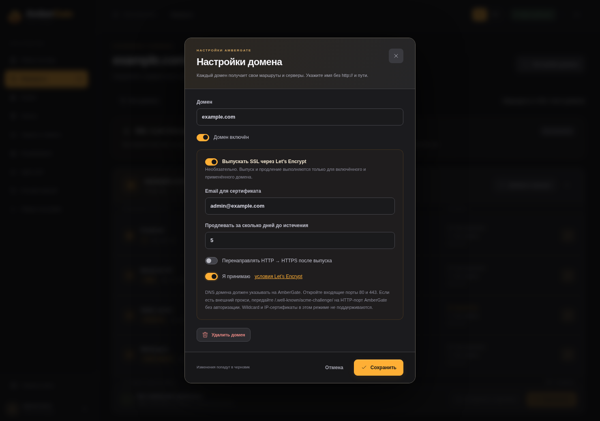

# Необязательный SSL через Let’s Encrypt

[English](ssl.md) · [Вернуться в README](../README.ru.md)

AmberGate умеет выпускать сертификаты и обслуживать HTTPS отдельно для каждого домена приложения. **По умолчанию SSL выключен.** Существующие HTTP-маршруты и внешний TLS-прокси продолжают работать без запросов сертификатов.

## Включение для домена

1. Направьте публичные DNS-записи A/AAAA домена на gateway. Каждый опубликованный адрес должен корректно вести на него.
2. Обеспечьте доступ из интернета к **TCP 80** AmberGate. Проверка HTTP-01 использует `/.well-known/acme-challenge/`. Этот путь нужен и при последующих продлениях.
3. Опубликуйте **TCP 443** для HTTPS приложений. В существующий Compose добавьте `443:443` в порты gateway. Для новой установки используйте `first-start.sh --with-tls` либо:

   ```bash
   docker compose -f compose.ghcr.yaml -f compose.tls.yaml up -d
   ```

4. Откройте **Маршруты → плитка домена → Настройки домена** и включите **«Выпускать SSL через Let’s Encrypt»**.
5. Укажите контактный email, примите условия Let’s Encrypt по ссылке и задайте срок продления. По умолчанию — **за 5 дней до истечения**. Перенаправление HTTP → HTTPS включается отдельно и начинает действовать только после получения сертификата.
6. Сохраните и нажмите **«Применить»**. Одно лишь сохранение черновика не запускает выпуск.



На странице домена видны ожидание, выпуск, активный сертификат, истечение или ошибка, срок действия, время продления и причина неудачной попытки. Статусы обновляются через существующее SSE-подключение.

## Продление и восстановление

Фоновый процесс проверяет применённые включённые домены каждые 30 секунд. Когда до истечения остаётся заданное число дней (1–30, по умолчанию 5), Certbot запрашивает новый сертификат. Nginx проверяет и подключает его автоматически. После успешной попытки действует часовая пауза, чтобы сертификаты с необычно коротким сроком не выпускались непрерывно.

После ошибки проверка повторяется через 5 минут; интервал постепенно увеличивается до 6 часов. Состояние повторных попыток сохраняется при перезапуске. При неудачном выпуске или reload остаётся предыдущий сертификат; если он истечёт, браузеры будут отклонять его, поэтому исправляйте ошибки на странице домена своевременно. Выключенные и удалённые домены не продлеваются. Выключение SSL не удаляет сохранённые ключи и историю сертификатов.

Certbot работает через webroot **в том же контейнере gateway**. Отдельный контейнер ACME, cron и база данных не нужны. Certbot не редактирует Nginx напрямую. Подключение сертификата проходит через проверку конфигурации и reload, сохраняет посторонние изменения черновика и использует неизменяемые файлы сертификатов для отката.

## Хранение и внешний прокси

- `/data/letsencrypt`: аккаунт ACME, выпущенные сертификаты, настройки продления и диагностика.
- `/data/tls`: установленные версии сертификатов, закрытые ключи и состояние повторных попыток. Сохраняйте весь `/data` в приватной резервной копии; экспорт конфигурации JSON **не содержит** сертификатов и закрытых ключей.
- Временный webroot HTTP-01 находится рядом с runtime-каталогом: по умолчанию `/run/ambergate-acme`.

Можно продолжать использовать внешний TLS-прокси. Если включаете SSL в AmberGate за ним, передайте путь HTTP-01 на порт 80 AmberGate без авторизации и перехвата. Сертификат внутри AmberGate не меняет сертификат, который отдаёт внешний прокси.

Панель и API агентов по-прежнему слушают HTTP на **8083**. SSL домена не публикует панель автоматически. Для администрирования и подключения агентов продолжайте использовать защищённый внешний HTTPS-прокси.

В первой реализации поддерживаются отдельные **DNS-домены и HTTP-01**. Wildcard, сертификаты для IP, DNS-01 через API провайдеров, загрузка своих сертификатов и HTTPS upstream не поддерживаются. Для повторных тестов не используйте production CA. В изолированной среде разработки `AMBERGATE_ACME_SERVER` задаёт тестовый ACME directory; в панели этого параметра нет.

[ACME smoke-тест](../tests/acme_smoke.py) использует настоящий Certbot и [Pebble](https://github.com/letsencrypt/pebble), проверяет HTTP-01 и HTTPS с проверкой сертификата без выпуска публичных сертификатов. [Требования Let’s Encrypt к HTTP-01](https://letsencrypt.org/docs/challenge-types/#http-01-challenge).
